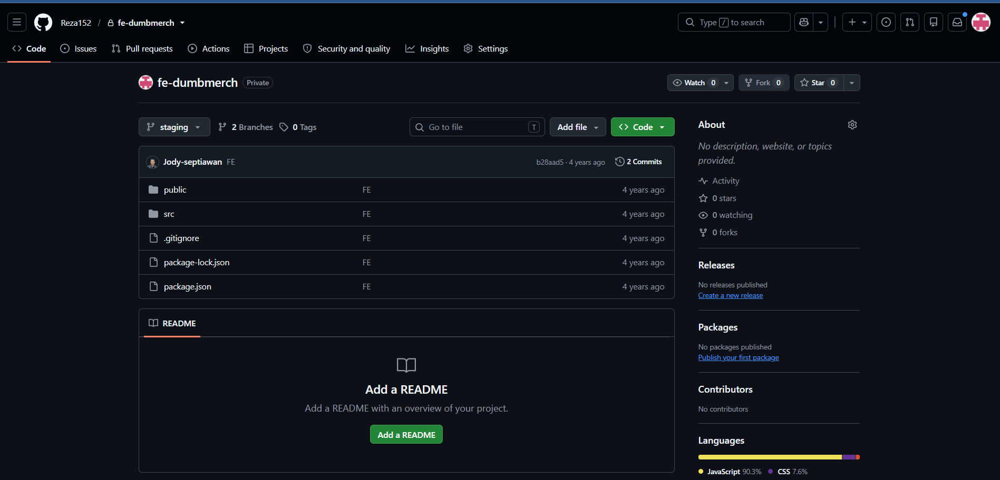
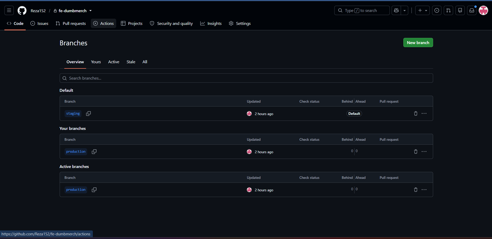
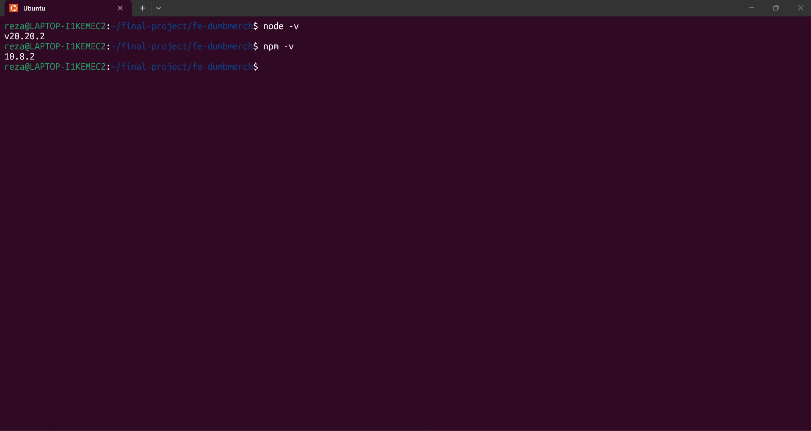
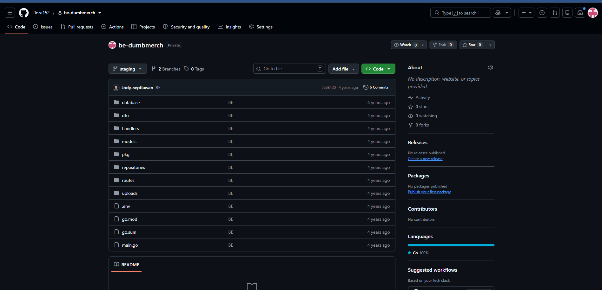
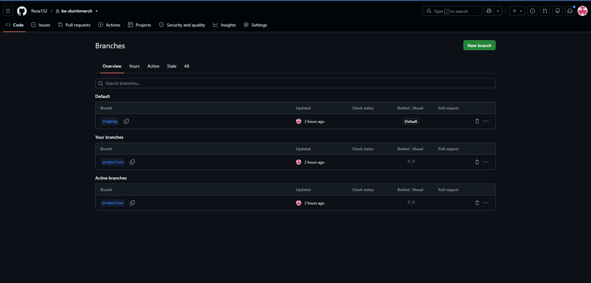
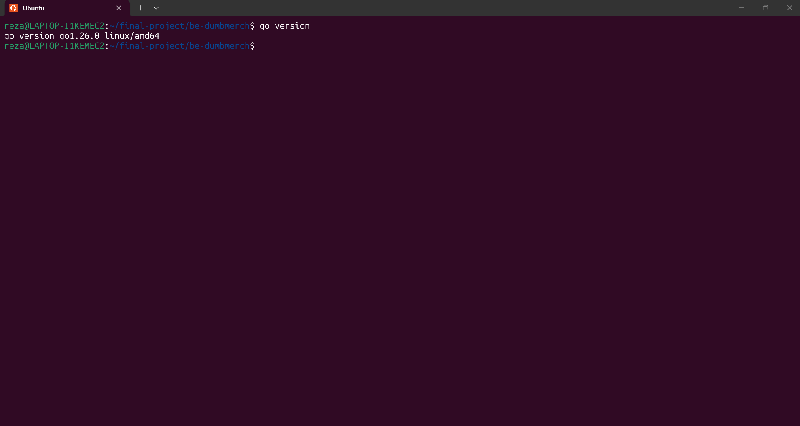

# 02 - Repository

## 1. Tujuan

Tahap Repository bertujuan untuk menyiapkan repository source code yang digunakan dalam Final Project DevOps.

Repository dipisahkan menjadi dua bagian aplikasi:

- Frontend
- Backend

Repository dibuat private untuk menjaga source code project.

Pada masing-masing repository digunakan dua branch:

- `staging`
- `production`

Branch tersebut digunakan untuk memisahkan environment staging dan production.


## 2. Frontend Repository

Frontend menggunakan repository private:

`fe-dumbmerch`

Repository digunakan untuk menyimpan source code frontend aplikasi DumbMerch.





## 3. Frontend Branch

Frontend memiliki dua branch utama:

- `staging`
- `production`

| Branch | Environment |
|---|---|
| `staging` | Staging |
| `production` | Production |





## 4. Frontend Node.js dan NPM

Frontend menggunakan Node.js dan NPM sebagai environment untuk menjalankan dan melakukan build aplikasi.

Versi yang digunakan:

```text
Node.js : v20.20.2
npm     : 10.8.2
```



### 5. Frontend Environment
Frontend menggunakan file .env untuk menentukan alamat Backend API.
Konfigurasi yang digunakan:
```
REACT_APP_BASEURL=https://api.reza.studentdumbways.my.id/api/v1
```
Variable tersebut digunakan oleh frontend untuk melakukan request ke Backend API.
File `.env` yang berisi konfigurasi environment tidak dimasukkan ke repository apabila mengandung data sensitif.

### 6. Backend Repository
Backend menggunakan repository private:
`be-dumbmerch`
Repository digunakan untuk menyimpan source code Backend aplikasi DumbMerch.


### 7. Backend Branch
Backend memiliki dua branch utama:
```
- staging
- production
```
| Branch | Environment |
|---|---|
| `staging` | Staging |
| `production` | Production |


### 8. Backend Go
Backend menggunakan bahasa pemrograman Go.
Versi Go yang digunakan:
```Go 1.26.0```




### 9. Backend Environment
Backend menggunakan file .env untuk menyimpan konfigurasi aplikasi dan koneksi database.
Konfigurasi tersebut digunakan untuk menghubungkan Backend dengan database PostgreSQL.
Data sensitif seperti password dan credential tidak ditampilkan pada dokumentasi.
File .env juga tidak dimasukkan ke repository.


