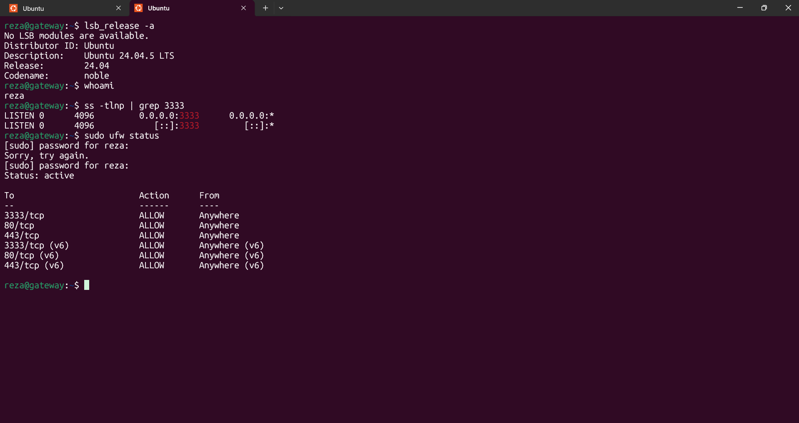
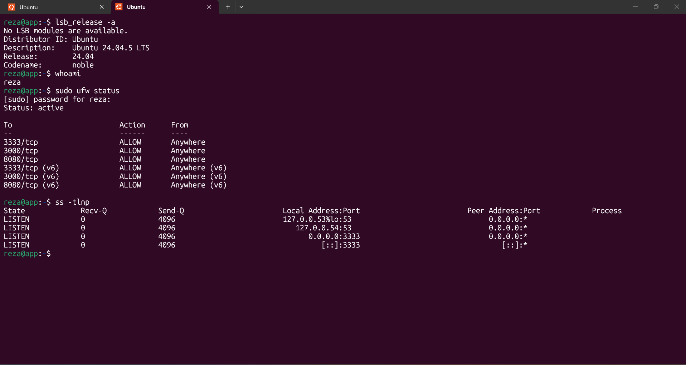
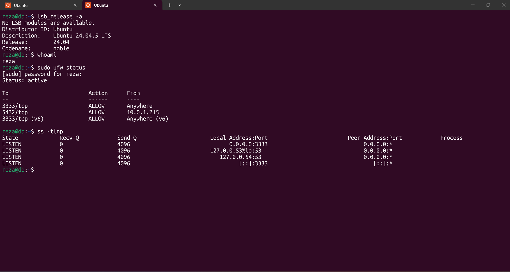

# 03 - Servers

## 1. Tujuan

Tahap Servers bertujuan untuk menyiapkan dan melakukan verifikasi terhadap server yang digunakan dalam Final Project DevOps.

Server dibuat menggunakan Terraform dan kemudian dikonfigurasi menggunakan Ansible.

Server yang digunakan terdiri dari:

| Server | Fungsi | CPU | RAM |
|---|---|---:|---:|
| Gateway | Gateway / Reverse Proxy | 1 CPU | 1 GB |
| App | Application Server | 2 CPU | 2 GB |
| DB | Database Server | 1 CPU | 1 GB |

Semua server menggunakan Ubuntu 24.04.5 LTS.

---

## 2. Gateway Server

Gateway digunakan sebagai Gateway / Reverse Proxy.

Konfigurasi:

| Item | Value |
|---|---|
| Host | `gateway` |
| Public IP | `15.232.170.170` |
| Private IP | `10.0.1.108` |
| CPU | 1 |
| RAM | 1 GB |
| User | `reza` |
| SSH Port | `3333` |

Pada Gateway dilakukan verifikasi terhadap versi Ubuntu, user, SSH port, dan firewall.

Hasil verifikasi:

```text
Ubuntu 24.04.5 LTS
User : reza
SSH  : 3333
UFW  : active
```
Port yang diizinkan:
```
3333/tcp
80/tcp
443/tcp
```


### 3. Application Server
Application Server digunakan untuk menjalankan aplikasi Frontend dan Backend.
Konfigurasi:

| Item | Value |
|---|---|
| Host | `app` |
| Public IP | `108.137.111.48` |
| Private IP | `10.0.1.215` |
| CPU | 2 |
| RAM | 2 GB |
| User | `reza` |
| SSH Port | `3333` |

Pada Application Server dilakukan verifikasi terhadap versi Ubuntu, user, firewall, dan port yang digunakan.
Hasil verifikasi:
```
Ubuntu 24.04.5 LTS
User : reza
UFW  : active
SSH  : 3333
```
Port yang terlihat pada konfigurasi firewall:
```
3333/tcp
3000/tcp
8080/tcp
```
Port 3333 digunakan untuk SSH.



### 4. Database Server
Database Server digunakan untuk menjalankan database aplikasi.
Konfigurasi:

| Item | Value |
|---|---|
| Host | `db` |
| Public IP | `15.232.94.115` |
| Private IP | `10.0.1.216` |
| CPU | 1 |
| RAM | 1 GB |
| User | `reza` |
| SSH Port | `3333` |

Pada Database Server dilakukan verifikasi terhadap versi Ubuntu, user, firewall, dan port yang digunakan.
Hasil verifikasi:
```
Ubuntu 24.04.5 LTS
User : reza
UFW  : active
SSH  : 3333

```
Port yang diizinkan:
```
3333/tcp
5432/tcp
```
Akses PostgreSQL pada port 5432 dibatasi dari private IP Application Server:
`10.0.1.215`



### 5. Terraform Server Configuration
Pembuatan server dilakukan menggunakan Terraform.
Terraform digunakan untuk membuat resource EC2 yang digunakan sebagai Gateway, App, dan DB.
Struktur module compute:

```
terraform/
└── modules/
    └── compute/
        ├── ec2.tf
        ├── outputs.tf
        ├── scripts/
        │   ├── app.sh
        │   ├── db.sh
        │   └── gateway.sh
        └── variables.tf

```
File `ec2.tf` digunakan untuk mendefinisikan instance EC2.
Konfigurasi server dibedakan berdasarkan fungsi:
```
- Gateway
- App
- DB
```
Terraform juga digunakan untuk menentukan spesifikasi instance seperti CPU, memory instance, subnet, security group, dan SSH key.
Konfigurasi network dan security group dikelola pada module terpisah:
```
terraform/
└── modules/
    ├── compute/
    ├── network/
    └── security/
```
Dengan pemisahan tersebut, konfigurasi infrastructure menjadi lebih terstruktur.

### 6. Ansible Server Configuration
Setelah server dibuat oleh Terraform, Ansible digunakan untuk melakukan konfigurasi awal server.
Inventory Ansible:

```
[gateway]
15.232.170.170

[app]
108.137.111.48

[db]
15.232.94.115
```

Variable koneksi SSH:
```
ansible_user: reza
ansible_port: 3333
ansible_ssh_private_key_file: ~/.ssh/terraform-reza
```
Ansible menggunakan user reza, port SSH 3333, dan SSH key yang sama untuk mengakses ketiga server.
Playbook konfigurasi awal:

``` 
---
- name: Configure all servers
  hosts: all
  become: true

  tasks:
    - name: Ensure user reza exists
      ansible.builtin.user:
        name: reza
        groups: sudo
        append: true
        state: present
```
Playbook tersebut digunakan untuk memastikan user reza tersedia pada seluruh server dan memiliki akses sudo.

### 7. SSH Configuration
Akses SSH ke ketiga server menggunakan satu SSH key.
SSH key:
`~/.ssh/terraform-reza`
Konfigurasi SSH:
```
Host gateway
    HostName 15.232.170.170
    User reza
    Port 3333
    IdentityFile ~/.ssh/terraform-reza

Host app
    HostName 108.137.111.48
    User reza
    Port 3333
    IdentityFile ~/.ssh/terraform-reza

Host db
    HostName 15.232.94.115
    User reza
    Port 3333
    IdentityFile ~/.ssh/terraform-reza
```
Dengan konfigurasi tersebut, server dapat diakses menggunakan alias:
```
ssh gateway
ssh app
ssh db
```
### 8. Firewall Configuration
Firewall menggunakan UFW.
Konfigurasi firewall berbeda berdasarkan fungsi masing-masing server.
`
Gateway
3333/tcp
80/tcp
443/tcp
`
`
App
3333/tcp
3000/tcp
8080/tcp
`
`
DB
3333/tcp
5432/tcp
`
Port PostgreSQL 5432 pada DB dibatasi agar dapat diakses dari Application Server dengan private IP:
`10.0.1.215`
