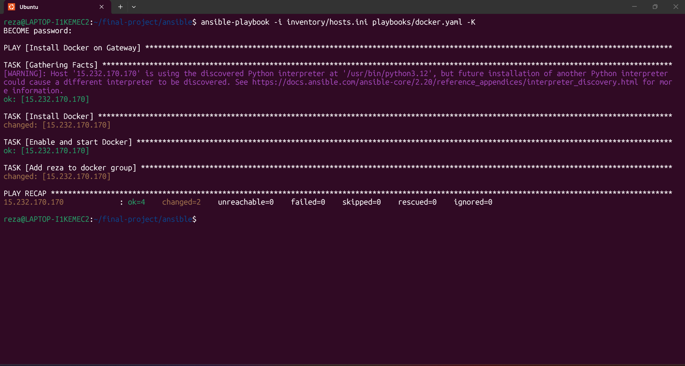
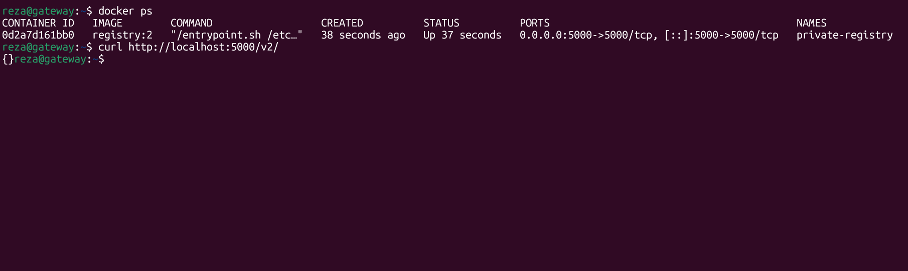
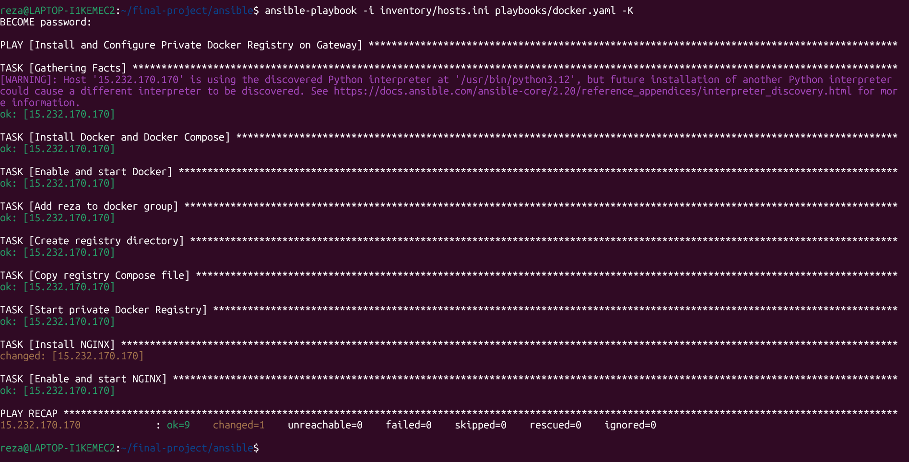
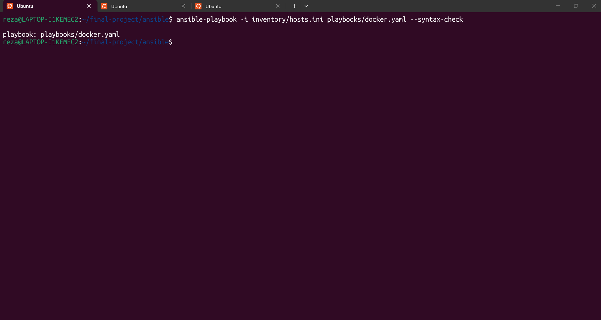
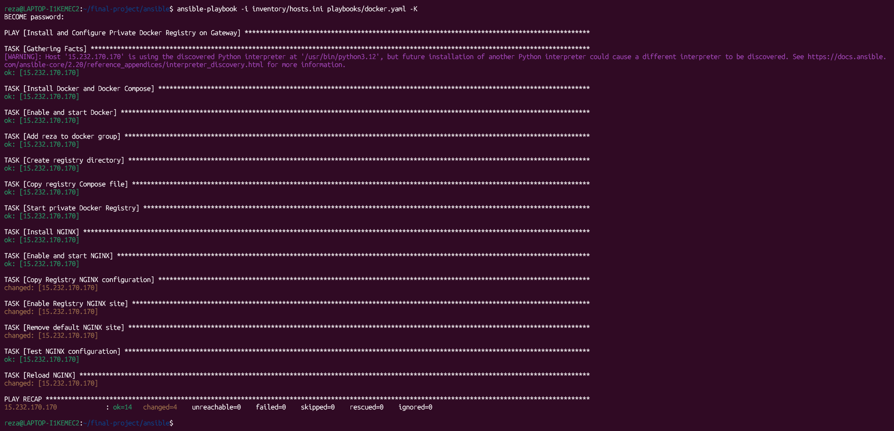
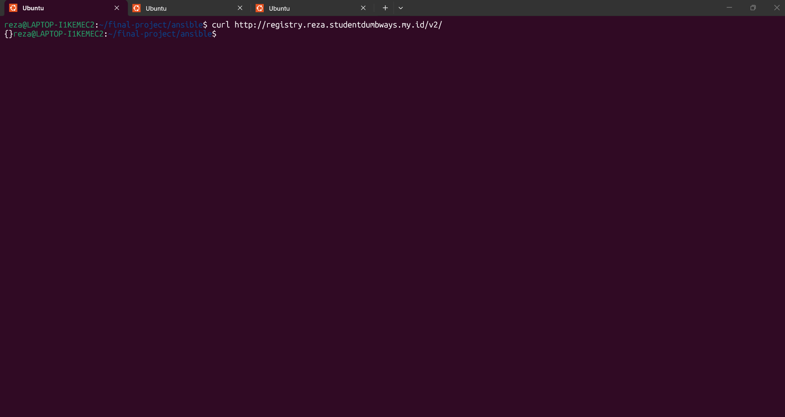

# 04 - Docker Registry Private

## 1. Tujuan

Tahap ini bertujuan untuk membuat Private Docker Registry yang digunakan sebagai tempat penyimpanan Docker image milik project.

Private Docker Registry digunakan agar image Frontend dan Backend dapat disimpan pada registry milik sendiri dan nantinya digunakan dalam proses deployment dan CI/CD.

Registry dijalankan pada Gateway Server.

Domain yang digunakan:

```text
registry.reza.studentdumbways.my.id
```

Server yang digunakan:
| Server | Public IP | Fungsi |
|---|---|---|
| Gateway | `15.232.170.170` | Private Docker Registry + NGINX |

## 2. Instalasi Docker Menggunakan Ansible
Docker pada Gateway diinstall menggunakan Ansible.
Playbook yang digunakan:
`ansible/playbooks/docker.yaml`

Playbook dijalankan pada host gateway:
```
---
- name: Install and Configure Private Docker Registry on Gateway
  hosts: gateway
  become: true

Install Docker dan Docker Compose:
- name: Install Docker and Docker Compose
  ansible.builtin.apt:
    name:
      - docker.io
      - docker-compose-v2
    state: present
    update_cache: true

Konfigurasi tersebut menginstall:
- docker.io
- docker-compose-v2
Kemudian Docker diaktifkan dan dijalankan:
- name: Enable and start Docker
  ansible.builtin.systemd:
    name: docker
    enabled: true
    state: started

User reza juga ditambahkan ke group Docker:
- name: Add reza to docker group
  ansible.builtin.user:
    name: reza
    groups: docker
    append: true
```
Menjalankan Ansible
Playbook dijalankan menggunakan:
`ansible-playbook -i inventory/hosts.ini playbooks/docker.yaml -K`

Hasil instalasi Docker berhasil:
`
PLAY RECAP
15.232.170.170 : ok=4 changed=2 unreachable=0 failed=0 skipped=0
`




## 3. Membuat Private Docker Registry
Setelah Docker tersedia pada Gateway, dibuat Docker Registry menggunakan image:
```registry:2``

File yang digunakan:
```ansible/files/registry/compose.yaml```

Isi file:
```
services:
  registry:
    image: registry:2
    container_name: private-registry
    restart: always
    ports:
      - "5000:5000"
    volumes:
      - registry_data:/var/lib/registry

volumes:
  registry_data:
```

Image Registry:
`image: registry:2`

digunakan sebagai image Private Docker Registry.
Nama container:
`container_name: private-registry`

sehingga container yang dibuat bernama:
`private-registry`

Registry menggunakan port:
```
ports:
  - "5000:5000"
```

Artinya port 5000 pada host diteruskan ke port 5000 di dalam container.
Registry juga menggunakan Docker volume:
```
volumes:
  - registry_data:/var/lib/registry
```
Volume registry_data digunakan untuk menyimpan data Registry pada:
```
/var/lib/registry
```
Dengan menggunakan volume, data Registry tidak hanya berada di dalam filesystem container.

## 4. Directory Registry
Ansible membuat directory:
```
/home/reza/registry

dengan konfigurasi:
- name: Create registry directory
  ansible.builtin.file:
    path: /home/reza/registry
    state: directory
    owner: reza
    group: reza
    mode: "0755"
```
File Compose kemudian dicopy ke:
```
/home/reza/registry/compose.yaml
```
Konfigurasi tersebut dilakukan oleh Ansible:
```
- name: Copy registry Compose file
  ansible.builtin.copy:
    src: ../files/registry/compose.yaml
    dest: /home/reza/registry/compose.yaml
    owner: reza
    group: reza
    mode: "0644"
```

## 5. Menjalankan Private Registry
Registry dijalankan menggunakan Docker Compose melalui Ansible:
```
- name: Start private Docker Registry
  ansible.builtin.command:
    cmd: docker compose -f /home/reza/registry/compose.yaml up -d
```
Setelah playbook dijalankan, container dapat diperiksa menggunakan:
```docker ps```

Hasil aktual:
```
CONTAINER ID   IMAGE        STATUS        PORTS
0d2a7d161bb0   registry:2   Up            0.0.0.0:5000->5000/tcp
```
Nama container:
```
private-registry
```




## 6. Testing Private Registry
Registry kemudian diuji secara lokal pada Gateway menggunakan:
``curl http://localhost:5000/v2/``

Response:
`{}`

Response {} menunjukkan endpoint Registry /v2/ berhasil diakses.
Registry menggunakan endpoint:
``/v2/``

untuk API Docker Registry.


## 7. Instalasi dan Konfigurasi NGINX
Private Registry kemudian diakses melalui domain menggunakan NGINX sebagai reverse proxy.
NGINX diinstall menggunakan Ansible:
```
- name: Install NGINX
  ansible.builtin.apt:
    name: nginx
    state: present
    update_cache: true
```
Kemudian service NGINX diaktifkan:
```
- name: Enable and start NGINX
  ansible.builtin.systemd:
    name: nginx
    enabled: true
    state: started
```
Hasil instalasi NGINX:



## 8. Konfigurasi NGINX Private Registry
File konfigurasi NGINX:
`ansible/files/registry/registry.conf`

Isi file:
```
server {
    listen 80;
    listen [::]:80;

    server_name registry.reza.studentdumbways.my.id;

    location / {
        proxy_pass http://127.0.0.1:5000;

        proxy_set_header Host $host;
        proxy_set_header X-Real-IP $remote_addr;
        proxy_set_header X-Forwarded-For $proxy_add_x_forwarded_for;
        proxy_set_header X-Forwarded-Proto $scheme;
    }
}
```
Penjelasan
Domain yang digunakan:
`server_name registry.reza.studentdumbways.my.id;`

Request dari domain tersebut diteruskan ke Registry:
`proxy_pass http://127.0.0.1:5000;`

Sehingga alurnya:
``
Client
   ↓
registry.reza.studentdumbways.my.id
   ↓
NGINX
   ↓
127.0.0.1:5000
   ↓
private-registry
``
NGINX juga meneruskan informasi request menggunakan:
```
proxy_set_header Host $host;
proxy_set_header X-Real-IP $remote_addr;
proxy_set_header X-Forwarded-For $proxy_add_x_forwarded_for;
proxy_set_header X-Forwarded-Proto $scheme;
```


## 9. Konfigurasi NGINX Menggunakan Ansible
File konfigurasi Registry dicopy ke:
``/etc/nginx/sites-available/registry.conf``

menggunakan:
```
- name: Copy Registry NGINX configuration
  ansible.builtin.copy:
    src: ../files/registry/registry.conf
    dest: /etc/nginx/sites-available/registry.conf
    owner: root
    group: root
    mode: "0644"
```
Kemudian konfigurasi diaktifkan melalui symbolic link:
```/etc/nginx/sites-enabled/registry.conf```

Default site NGINX dihapus:
```
- name: Remove default NGINX site
  ansible.builtin.file:
    path: /etc/nginx/sites-enabled/default
    state: absent
```
Setelah itu konfigurasi NGINX diuji:
```
- name: Test NGINX configuration
  ansible.builtin.command:
    cmd: nginx -t
  changed_when: false
```
Jika konfigurasi valid, NGINX direload:
```
- name: Reload NGINX
  ansible.builtin.systemd:
    name: nginx
    state: reloaded
```

## 10. Ansible Syntax Check
Sebelum menjalankan playbook, dilakukan pengecekan syntax:
```ansible-playbook -i inventory/hosts.ini playbooks/docker.yaml --syntax-check```

Hasil:
``playbook: playbooks/docker.yaml``

Artinya playbook berhasil melewati syntax check.




## 11. Menjalankan Konfigurasi Registry dan NGINX
Playbook dijalankan kembali:
```ansible-playbook -i inventory/hosts.ini playbooks/docker.yaml -K```

Playbook menjalankan beberapa konfigurasi:

```
1. Install Docker dan Docker Compose.
2. Enable Docker.
3. Menambahkan user reza ke Docker group.
4. Membuat directory Registry.
5. Menyalin file Compose.
6. Menjalankan Private Docker Registry.
7. Install NGINX.
8. Enable NGINX.
9. Menyalin konfigurasi NGINX Registry.
10. Mengaktifkan konfigurasi Registry.
11. Menghapus default NGINX site.
12. Melakukan nginx -t.
13. Reload NGINX.
```

Hasil akhir:
PLAY RECAP
```15.232.170.170 : ok=14 changed=4 unreachable=0 failed=0 skipped=0```



## 12. Konfigurasi DNS
Domain Private Registry:
``registry.reza.studentdumbways.my.id``

diarahkan ke Public IP Gateway:
``15.232.170.170``

Dengan demikian request menuju domain Registry akan masuk ke Gateway terlebih dahulu.


## 13. Testing Registry melalui Domain
Setelah DNS dan NGINX dikonfigurasi, Registry diuji melalui domain:
```curl http://registry.reza.studentdumbways.my.id/v2/```

Response:
``{}``

Response tersebut menunjukkan request berhasil mencapai Registry melalui NGINX reverse proxy.


