# 05 - Deployment Apps

## 1. Tujuan

Task ini digunakan untuk melakukan deployment aplikasi DumbMerch menggunakan Docker.

Deployment terdiri dari:
- PostgreSQL pada DB Server
- Backend pada App Server
- Frontend pada App Server
- Staging dan Production
- Docker image menggunakan multistage build
- Replica Backend dan Frontend
- NGINX sebagai load balancer

---

## 2. Arsitektur

```text
                    Internet
                       |
                       v
                +-------------+
                |   Gateway   |
                |    NGINX    |
                +------+------+
                       |
             +---------+---------+
             |                   |
             v                   v
        Frontend             Backend
        Production           Production
        3003 / 3005          3002 / 3004
             |                   |
             +---------+---------+
                       |
                       v
                 PostgreSQL
                  DB Server
                  10.0.1.216
                       |
                       v
               /home/reza/storage
```


Server yang digunakan:
| Server | IP | Fungsi |
|---|---|---|
| Gateway | 15.232.170.170 | NGINX |
| App | 108.137.111.48 | Frontend + Backend |
| DB | 15.232.94.115 | PostgreSQL |

## 3. PostgreSQL
PostgreSQL digunakan sebagai database aplikasi dan dijalankan menggunakan Docker pada DB Server.
Playbook yang digunakan:
```ansible/playbooks/postgres.yaml``

PostgreSQL menggunakan image:
```postgres:16```

Port:
```5432```

Database:
```
User     : wayshub
Database : dumbmerch
```
Storage:
```
/home/reza/storage
```
Storage tersebut di-mount ke:
```/var/lib/postgresql/data```

### 3.1 Playbook PostgreSQL
File:
```ansible/playbooks/postgres.yaml```

Konfigurasi utama:
```
- name: Deploy PostgreSQL on Database Server
  hosts: db
  become: true

  tasks:
    - name: Install Docker
      ansible.builtin.apt:
        name: docker.io
        state: present
        update_cache: true

    - name: Enable and start Docker
      ansible.builtin.systemd:
        name: docker
        enabled: true
        state: started

    - name: Create PostgreSQL storage directory
      ansible.builtin.file:
        path: /home/reza/storage
        state: directory
        owner: reza
        group: reza
        mode: "0755"

    - name: Run PostgreSQL container
      ansible.builtin.command:
        cmd: >
          docker run -d
          --name postgres
          --restart always
          -e POSTGRES_USER=wayshub
          -e POSTGRES_PASSWORD=kar
          -e POSTGRES_DB=dumbmerch
          -p 5432:5432
          -v /home/reza/storage:/var/lib/postgresql/data
          postgres:16
```
Playbook membuat directory storage kemudian menjalankan PostgreSQL menggunakan Docker.
Volume:
```
/home/reza/storage
        |
        v
/var/lib/postgresql/data
```
Dengan demikian data PostgreSQL tidak hanya berada di dalam container.

### 3.2 Syntax Check
Sebelum menjalankan playbook dilakukan syntax check:
```ansible-playbook -i inventory/hosts.ini playbooks/postgres.yaml --syntax-check```

Hasil:
```playbook: playbooks/postgres.yaml```

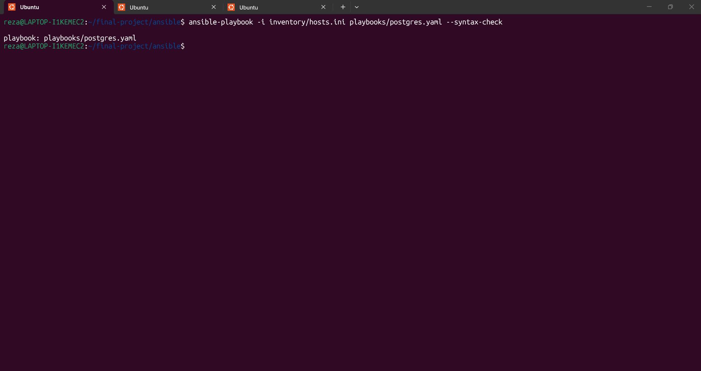

### 3.3 PostgreSQL Running
Setelah playbook dijalankan, container PostgreSQL diperiksa untuk memastikan container berjalan.
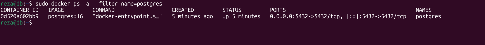

### 3.4 PostgreSQL Volume
Storage PostgreSQL diperiksa untuk memastikan directory `/home/reza/storage` digunakan sebagai persistent storage.
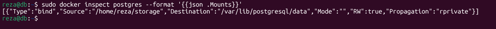

### 3.5 Remote Database
App Server harus dapat terhubung ke PostgreSQL pada DB Server.
Pengujian dilakukan dari App Server:
```nc -zv 10.0.1.216 5432```

Hasil:
```Connection to 10.0.1.216 5432 port [tcp/postgresql] succeeded!```
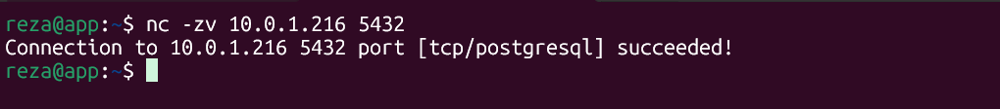


## 4. Docker pada App Server
Docker digunakan sebagai runtime untuk menjalankan Backend dan Frontend.
Playbook:
```ansible/playbooks/docker-app.yaml```

Playbook melakukan:
- install Docker
- install Docker Compose
- menjalankan Docker
- menambahkan user reza ke group Docker

### 4.1 Syntax Check
```ansible-playbook -i inventory/hosts.ini playbooks/docker-app.yaml --syntax-check```

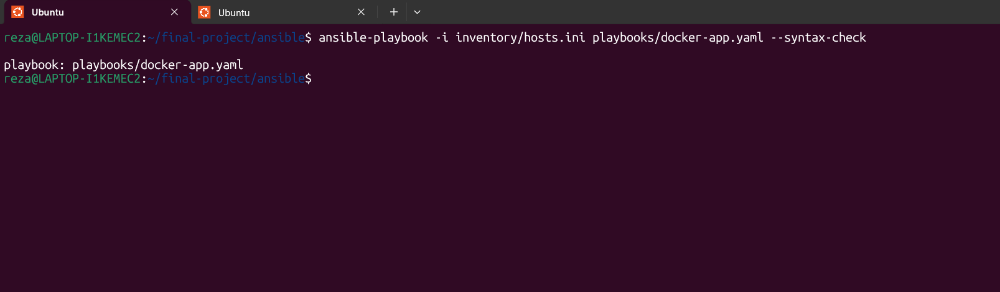

### 4.2 Install Docker
Playbook dijalankan pada App Server.

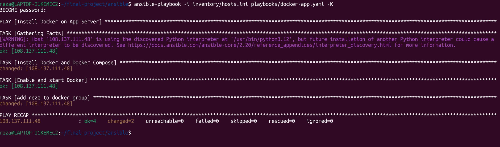

### 4.3 Docker Version
Versi Docker dan Docker Compose diperiksa untuk memastikan Docker berhasil terinstall.

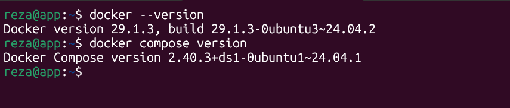

## 5. Backend
Backend DumbMerch menggunakan bahasa Go.
Deployment Backend menggunakan:
```ansible/playbooks/backend.yaml```

Repository:
```git@github.com:Reza152/be-dumbmerch.git```

Private Registry:
```registry.reza.studentdumbways.my.id```

Backend memiliki dua environment:
| Environment | Branch | Container | Port |
|---|---|---|---|
| Staging | staging | dumbmerch-backend | 3000 |
| Production | production | dumbmerch-backend-production | 3002 |

Replica production:
```dumbmerch-backend-production-2```

Port replica:
```3004```

### 6. Backend Multistage Dockerfile
Backend menggunakan multistage build agar proses build dan runtime dipisahkan.
Dockerfile:
```
FROM golang:1.22-alpine AS builder

WORKDIR /app

COPY go.mod go.sum ./

RUN go mod download

COPY . .

RUN go build -o dumbmerch .

FROM alpine:3.20

WORKDIR /app

RUN apk add --no-cache ca-certificates

COPY --from=builder /app/dumbmerch .

COPY --from=builder /app/uploads ./uploads

EXPOSE 3000

CMD ["./dumbmerch"]
```
Stage pertama:
```golang:1.22-alpine```

digunakan untuk melakukan proses build aplikasi Go.
Bagian:
```RUN go build -o dumbmerch .```

menghasilkan binary aplikasi.
Stage kedua:
```alpine:3.20```

digunakan sebagai runtime.
Binary hasil build kemudian dipindahkan menggunakan:
```COPY --from=builder /app/dumbmerch .```

Dengan multistage build, compiler dan dependency build tidak perlu dibawa ke image runtime.

## 7. Build Backend Image
Backend kemudian dibuild menjadi Docker image.
Contoh image:
dumbmerch-backend:staging

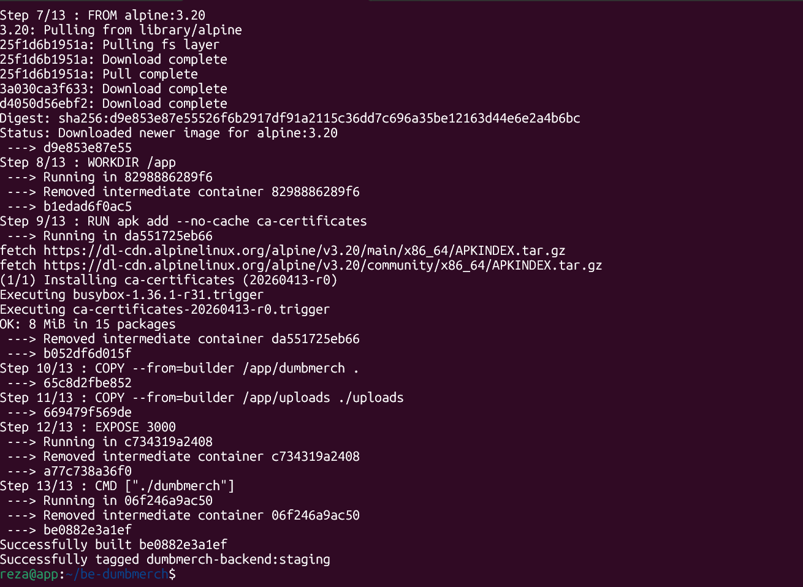

### 7.1 Backend Image
Image hasil build diperiksa menggunakan Docker.
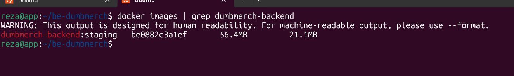

## 8. Private Docker Registry
Image Backend tidak hanya dijalankan dari image lokal.
Image dikirim ke Private Docker Registry:
```registry.reza.studentdumbways.my.id```

Alurnya:
``
Backend Source
      |
      v
Docker Build
      |
      v
Docker Image
      |
      v
Private Registry
      |
      v
Docker Pull
      |
      v
Backend Container
``

### 8.1 Registry NGINX
Pada proses deployment dilakukan konfigurasi agar image dapat dikirim dan diambil dari registry.

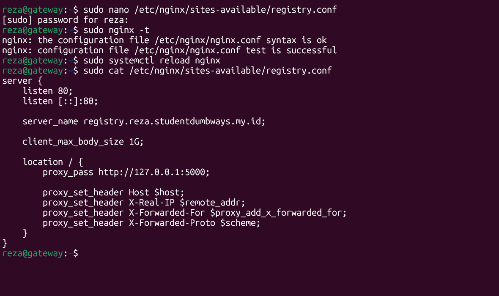

### 8.2 Push Backend Image
Image kemudian diberikan tag registry:
```registry.reza.studentdumbways.my.id/dumbmerch-backend:staging```

Kemudian image di-push ke private registry.
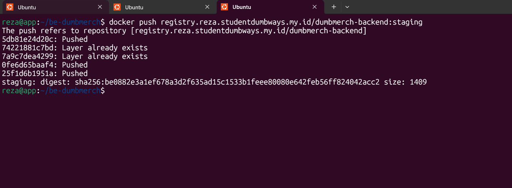

### 8.3 Pull Backend Image
Setelah image berada di registry, image di-pull kembali dari registry.

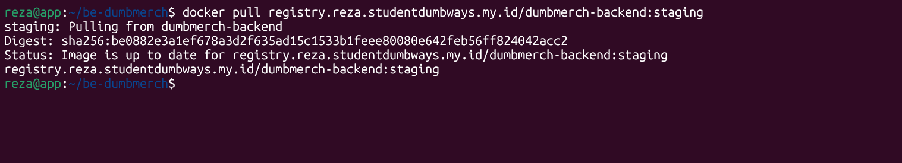

## 9. Backend Container
Backend kemudian dijalankan menggunakan image dari private registry.
Production:
```dumbmerch-backend-production```

Port:
```3002 -> 3000```

Artinya:
``
App Server port 3002
        |
        v
Container port 3000
``

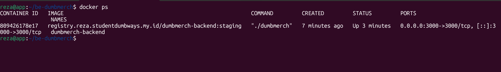


## 10. Backend API Testing
Setelah container berjalan, API Backend diuji.
Endpoint:
```/api/v1/products```

Testing:
```curl http://localhost:3002/api/v1/products```

Hasil:
```
{
  "code": 200,
  "data": []
}
```
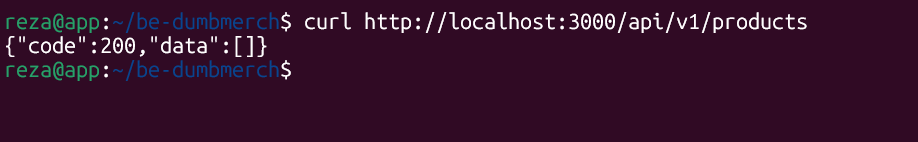

## 11. Frontend
Frontend menggunakan React dan dijalankan menggunakan Docker.
Playbook:
```ansible/playbooks/frontend.yaml```

Repository:
```git@github.com:Reza152/fe-dumbmerch.git```

Environment:
| Environment | Branch | Container | Port |
|---|---|---|---|
| Staging | staging | dumbmerch-frontend | 3001 |
| Production | production | dumbmerch-frontend-production | 3003 |

Replica production:
```dumbmerch-frontend-production-2```

Port replica:
```3005```

## 12. Frontend Multistage Dockerfile
Frontend juga menggunakan multistage build.
```
FROM node:20-alpine AS builder

WORKDIR /app

COPY package*.json ./

RUN npm ci

COPY . .

ENV NODE_OPTIONS=--openssl-legacy-provider

RUN npm run build

FROM nginx:alpine

COPY --from=builder /app/build /usr/share/nginx/html

EXPOSE 80

CMD ["nginx", "-g", "daemon off;"]
```
Stage pertama menggunakan:
```node:20-alpine```

untuk melakukan proses build React.
Build dilakukan dengan:
```RUN npm run build```

Hasil build kemudian dipindahkan ke NGINX:
```COPY --from=builder /app/build /usr/share/nginx/html```

Stage kedua menggunakan:
```nginx:alpine```

sebagai web server untuk menjalankan hasil build React.

## 13. Production Replica
Untuk memenuhi kebutuhan load balancing, production memiliki replica Backend dan Frontend.
Backend:
```
dumbmerch-backend-production
        |
        +-- 3002 -> 3000

dumbmerch-backend-production-2
        |
        +-- 3004 -> 3000
```
Frontend:
```
dumbmerch-frontend-production
        |
        +-- 3003 -> 80

dumbmerch-frontend-production-2
        |
        +-- 3005 -> 80
```
Staging tetap berjalan:
```
Frontend : 3001 -> 80
Backend  : 3000 -> 3000
```
Replica dibuat menggunakan:
```ansible/playbooks/loadbalancer.yaml```
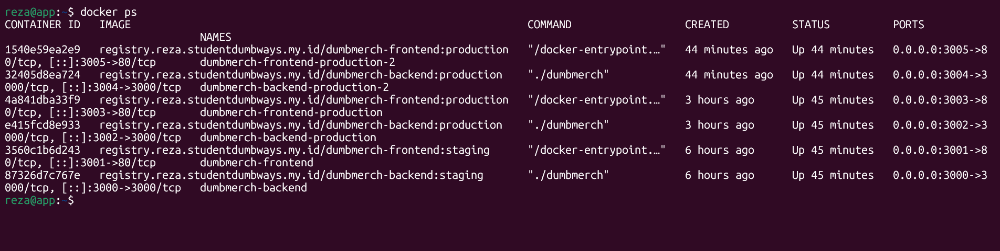

## 14. NGINX Load Balancing
Gateway menggunakan NGINX sebagai load balancer.
Playbook:
```ansible/playbooks/loadbalancer-nginx.yaml```

NGINX menggunakan private IP App Server:
``10.0.1.215``

Backend upstream:
```
upstream backend_production {
    server 10.0.1.215:3002;
    server 10.0.1.215:3004;
}

Frontend upstream:
upstream frontend_production {
    server 10.0.1.215:3003;
    server 10.0.1.215:3005;
}
```

Request API:
```
api.reza.studentdumbways.my.id
              |
              v
       backend_production
          /          \
         v            v
      :3002         :3004
```
Request Frontend:
```
reza.studentdumbways.my.id
              |
              v
       frontend_production
          /          \
         v            v
      :3003         :3005
```

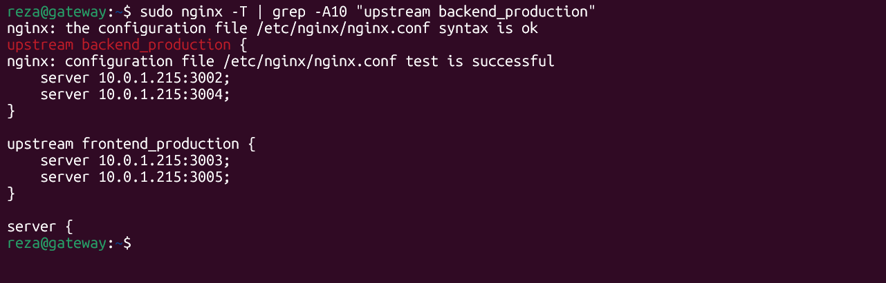


## 15. Load Balancer Testing
Setelah konfigurasi NGINX selesai, dilakukan pengujian melalui Gateway.
Command:
```
curl -H "Host: api.reza.studentdumbways.my.id" \
http://127.0.0.1/api/v1/products
```
Hasil:
```
{
  "code": 200,
  "data": []
}
```
Frontend juga berhasil memberikan HTTP 200.
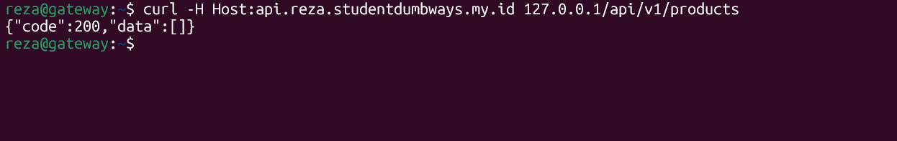
