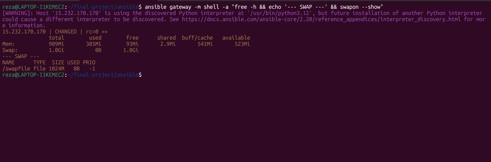
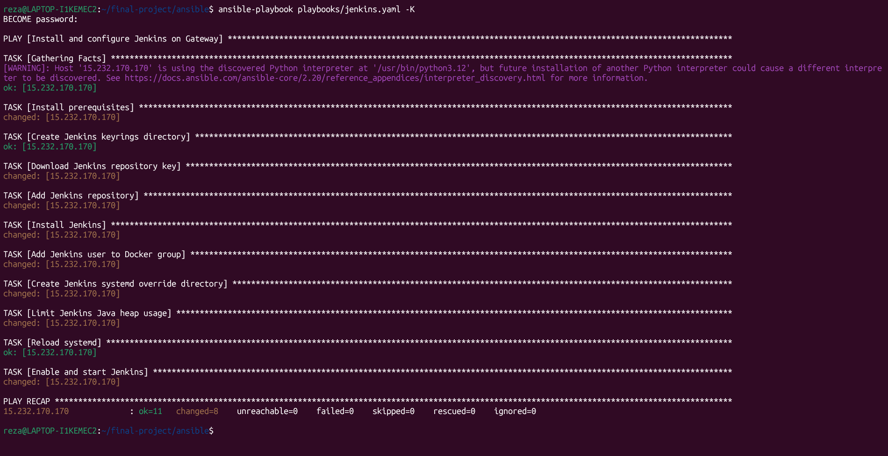
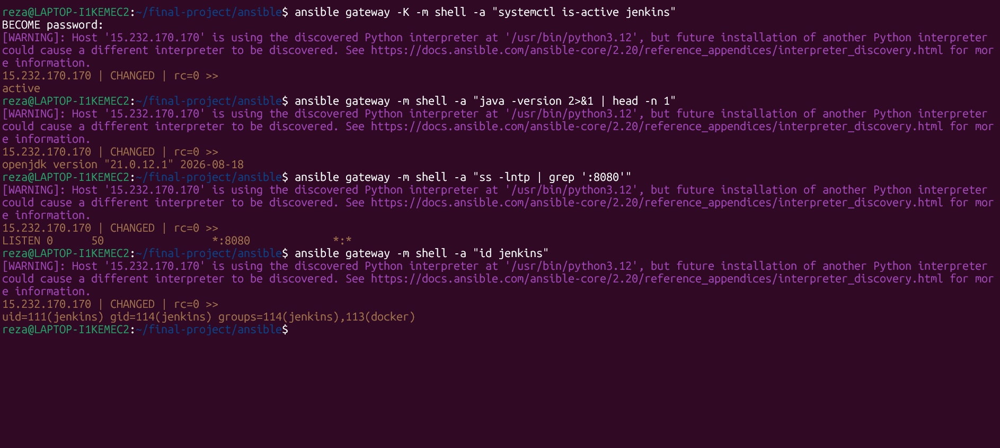
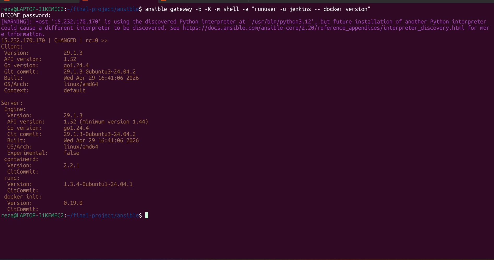
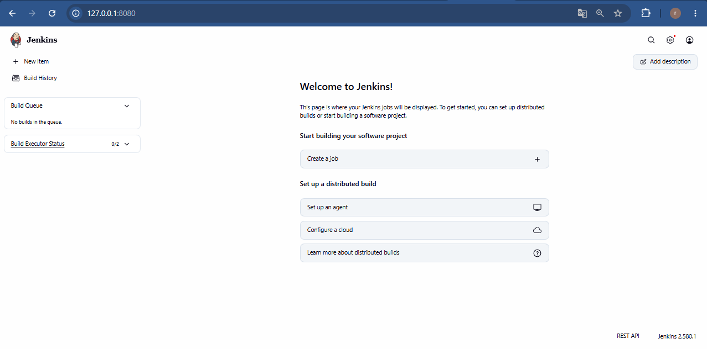
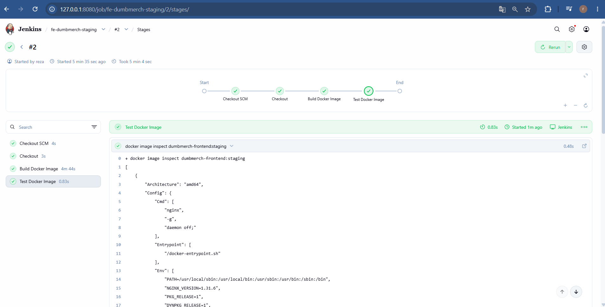
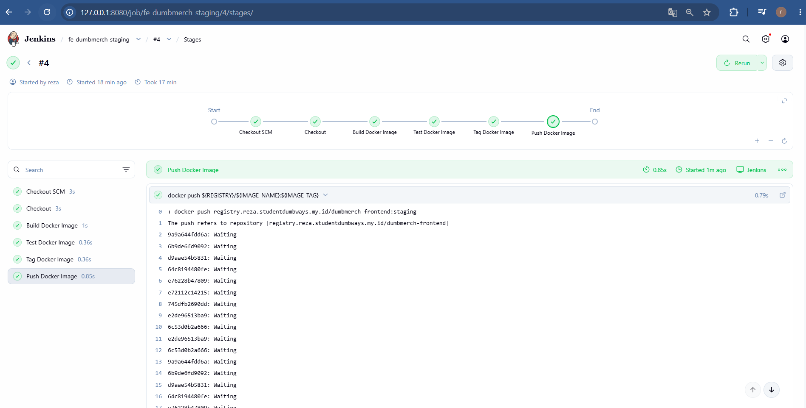
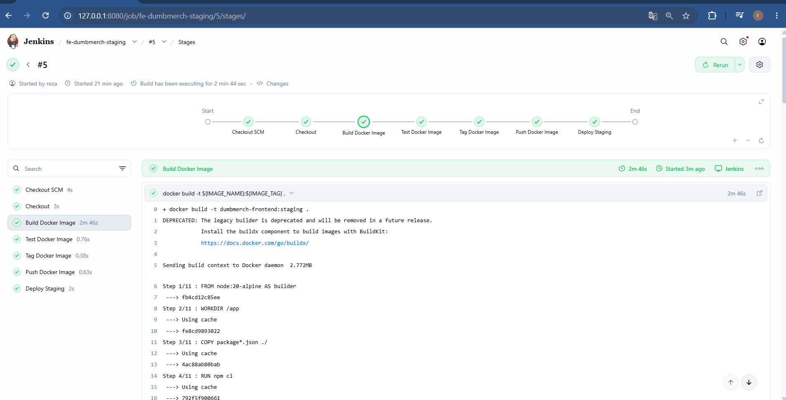
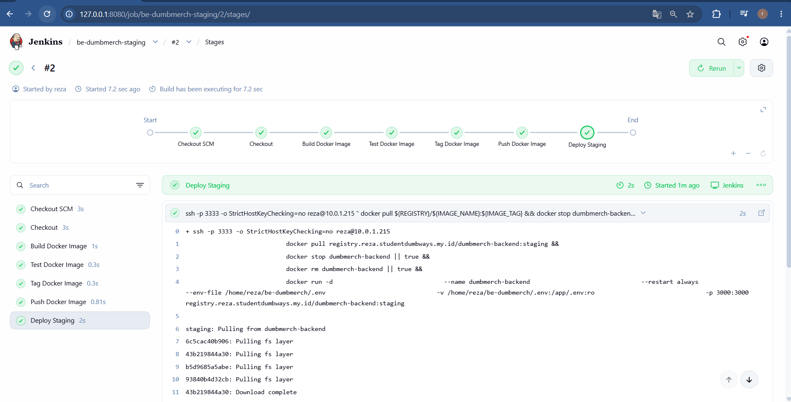

## Arsitektur Server
```
Gateway
Public IP  : 15.232.170.170
Private IP : 10.0.1.108
SSH Port   : 3333
Jenkins    : 8080
```
Gateway menjalankan Jenkins dan Docker yang digunakan oleh Jenkins untuk proses CI/CD.
```
App Server
Private IP : 10.0.1.215
SSH Port   : 3333
```
App Server digunakan sebagai tempat deployment container Frontend dan Backend.
Alur komunikasinya:
```
Jenkins
   |
   | SSH :3333
   v
App Server
10.0.1.215
```
## Persiapan Gateway
Sebelum menjalankan Jenkins, Gateway dipastikan mempunyai swap.
Command yang digunakan:
```ansible gateway -m shell -a "free -h && echo '--- SWAP ---' && swapon --show"```

Hasil:
```
Mem: 909Mi
Swap: 1.0Gi
```



Dengan demikian Gateway sudah mempunyai tambahan virtual memory sebelum Jenkins dijalankan.

## Instalasi Jenkins Menggunakan Ansible
Jenkins tidak di-install secara manual.
Instalasi dilakukan menggunakan Ansible Playbook:
playbooks/jenkins.yaml

Playbook menargetkan Gateway:
---
- name: Install and configure Jenkins on Gateway
  hosts: gateway
  become: true

4.1 Install Dependency
Playbook memasang dependency:
```
- name: Install prerequisites
  ansible.builtin.apt:
    name:
      - ca-certificates
      - curl
      - fontconfig
      - openjdk-21-jre
      - git
    state: present
    update_cache: true
```
Dependency tersebut digunakan untuk menyiapkan environment Jenkins.
Java yang digunakan adalah:
```OpenJDK 21```

Git digunakan agar Jenkins dapat melakukan proses checkout repository.
Swap:
```
NAME       TYPE  SIZE  USED  PRIO
/swapfile  file  1024M 0B   -1
```

### 4.2 Repository Jenkins
Playbook mengambil repository key Jenkins:
```
- name: Download Jenkins repository key
  ansible.builtin.get_url:
    url: https://pkg.jenkins.io/debian-stable/jenkins.io-2026.key
    dest: /usr/share/keyrings/jenkins-keyring.asc
```
Kemudian repository Jenkins ditambahkan:
```
- name: Add Jenkins repository
  ansible.builtin.apt_repository:
    repo: "deb [signed-by=/usr/share/keyrings/jenkins-keyring.asc] https://pkg.jenkins.io/debian-stable binary/"
    filename: jenkins
    state: present
```
Setelah repository tersedia, Jenkins di-install:
```
- name: Install Jenkins
  ansible.builtin.apt:
    name: jenkins
    state: present
    update_cache: true
```
Source tersebut merupakan konfigurasi aktual jenkins.yaml. 

## 4.3 Konfigurasi SonarQube Plugin
Jenkins juga dipasang plugin SonarQube Scanner:
```
- name: Install SonarQube Scanner Jenkins plugin
  community.general.jenkins_plugin:
    name: sonar
    state: present
    url: http://127.0.0.1:8080
    url_username: reza
    url_password: "{{ lookup('ansible.builtin.env', 'JENKINS_PASSWORD') }}"
    with_dependencies: true
```
Password Jenkins tidak ditulis langsung di playbook, tetapi diambil dari environment variable:
```JENKINS_PASSWORD```

## Menjalankan Playbook Jenkins
Playbook dijalankan dengan:
```ansible-playbook playbooks/jenkins.yaml -K```

Hasil:
```
PLAY RECAP

15.232.170.170 :
ok=11
changed=8
unreachable=0
failed=0

Bagian penting:
failed=0
```
menunjukkan playbook berhasil dijalankan tanpa error.



## Verifikasi Jenkins
Setelah instalasi selesai, Jenkins diverifikasi menggunakan Ansible.

### Verifikasi Service
Command:
```ansible gateway -K -m shell -a "systemctl is-active jenkins"```

Output:
```active```

Artinya service Jenkins sedang aktif.

### Verifikasi Java
Command:
```ansible gateway -m shell -a "java -version 2>&1 | head -n 1"```

Output:
```openjdk version "21.0.12.1"```

### Verifikasi Port Jenkins
Command:
```ansible gateway -m shell -a "ss -lntp | grep ':8080'"```

Jenkins listen pada:
```8080```

### Verifikasi User Jenkins
Command:
```ansible gateway -m shell -a "id jenkins"```

Hasil:
```
uid=111(jenkins)
gid=114(jenkins)
groups=114(jenkins),113(docker)
```
Hasil tersebut menunjukkan user jenkins sudah menjadi anggota group docker.



## Jenkins Diberikan Akses Docker
Agar Jenkins dapat menjalankan proses Docker, playbook menambahkan user jenkins ke group Docker:
```
- name: Add Jenkins user to Docker group
  ansible.builtin.user:
    name: jenkins
    groups: docker
    append: true
```
Source tersebut merupakan bagian dari konfigurasi aktual Jenkins. 

Kemudian akses Docker diverifikasi:
```ansible gateway -b -K -m shell -a "runuser -u jenkins -- docker version"```

Hasil menunjukkan Docker Client dan Docker Server dapat diakses oleh user Jenkins.



## Membatasi Memory Jenkins
Gateway mempunyai resource terbatas sehingga Java heap Jenkins dibatasi.
Ansible membuat systemd override:
```
- name: Limit Jenkins Java heap usage
  ansible.builtin.copy:
    dest: /etc/systemd/system/jenkins.service.d/override.conf
    content: |
      [Service]
      Environment="JAVA_OPTS=-Xms256m -Xmx512m"
```
Konfigurasinya:
```
Minimum heap : 256 MB
Maximum heap : 512 MB
```
Kemudian systemd di-reload:
```
- name: Reload systemd
  ansible.builtin.systemd:
    daemon_reload: true

dan Jenkins direstart:
- name: Enable and start Jenkins
  ansible.builtin.systemd:
    name: jenkins
    enabled: true
    state: restarted
```

## Jenkins Dashboard
Setelah Jenkins aktif, dashboard dapat diakses pada:
```http://127.0.0.1:8080```

Dashboard menampilkan:
```Welcome to Jenkins!```

Versi Jenkins:
```Jenkins 2.580.1```



Pada tahap ini Jenkins sudah siap digunakan untuk menjalankan pipeline CI/CD.

## Pipeline Frontend Staging
Setelah Jenkins siap, proses dilanjutkan dengan pipeline Frontend staging.
Pipeline menjalankan urutan:
Checkout SCM
```
      |
      v
Checkout
      |
      v
Build Docker Image
      |
      v
Test Docker Image
      |
      v
Tag Docker Image
      |
      v
Push Docker Image
      |
      v
Deploy Staging
  ```

### Checkout
Tahap pertama adalah mengambil source code dari repository.
Checkout SCM

kemudian:
```Checkout```

Source code digunakan sebagai build context Docker.


## Build Docker Image Frontend
Setelah source code tersedia, Jenkins melakukan build:
```docker build -t dumbmerch-frontend:staging .```

Image yang dihasilkan:
```dumbmerch-frontend:staging```




Pada screenshot terlihat stage:
```
Checkout SCM       ✓
Checkout            ✓
Build Docker Image  ✓
Test Docker Image   ✓
```

## Test Docker Image Frontend
Setelah image berhasil dibuat, Jenkins melakukan pengecekan menggunakan:
```docker image inspect dumbmerch-frontend:staging```

Console Jenkins menunjukkan image berhasil di-inspect.
Architecture image:
```amd64```

Dengan demikian image yang dibuat dapat diperiksa sebelum dikirim ke registry.


## Tag Docker Image
Image lokal kemudian diberikan tag Private Registry:
```docker tag dumbmerch-frontend:staging \```
```registry.reza.studentdumbways.my.id/dumbmerch-frontend:staging```

Sehingga image menjadi:
```registry.reza.studentdumbways.my.id/dumbmerch-frontend:staging```

## Push Frontend ke Private Registry
Setelah tagging, Jenkins melakukan push:
```docker push registry.reza.studentdumbways.my.id/dumbmerch-frontend:staging```

Image dikirim ke:
```registry.reza.studentdumbways.my.id```

dengan:
```
Image : dumbmerch-frontend
Tag   : staging
```



Pada tahap ini image Frontend sudah tersedia pada Private Docker Registry.

## Deploy Frontend ke App Server
Setelah image tersedia di registry, Jenkins melakukan deployment ke App Server:
```10.0.1.215```

SSH menggunakan:
```
Port : 3333
User : reza
```
Koneksi:
```ssh -p 3333 -o StrictHostKeyChecking=no reza@10.0.1.215```

Kemudian image staging di-pull:
```docker pull registry.reza.studentdumbways.my.id/dumbmerch-frontend:staging```

Container lama dihentikan dan dihapus, kemudian container baru dijalankan menggunakan image terbaru.
Pipeline menunjukkan:
```
Deploy Staging ✓
```





## Pipeline Backend Staging
Setelah Frontend, proses CI/CD juga diterapkan pada Backend staging.
Alurnya sama:
```
Checkout SCM
      |
      v
Checkout
      |
      v
Build Docker Image
      |
      v
Test Docker Image
      |
      v
Tag Docker Image
      |
      v
Push Docker Image
      |
      v
Deploy Staging
```
Image Backend:
```registry.reza.studentdumbways.my.id/dumbmerch-backend:staging```

## Build dan Push Backend
Backend menggunakan image:
```dumbmerch-backend:staging```

Kemudian diberi tag:
```registry.reza.studentdumbways.my.id/dumbmerch-backend:staging```

Push dilakukan menggunakan:
```docker push registry.reza.studentdumbways.my.id/dumbmerch-backend:staging```

## Deploy Backend
Jenkins melakukan SSH ke:
```10.0.1.215```

kemudian melakukan pull:
```docker pull registry.reza.studentdumbways.my.id/dumbmerch-backend:staging```

Container lama dihentikan:
```docker stop dumbmerch-backend || true```

Kemudian dihapus:
```docker rm dumbmerch-backend || true```

Container baru dijalankan:
```
docker run -d \
  --name dumbmerch-backend \
  --restart always \
  --env-file /home/reza/be-dumbmerch/.env \
  -v /home/reza/be-dumbmerch/.env:/app/.env:ro \
  -p 3000:3000 \
  registry.reza.studentdumbways.my.id/dumbmerch-backend:staging
```


Pipeline Backend staging berhasil sampai tahap deployment.


