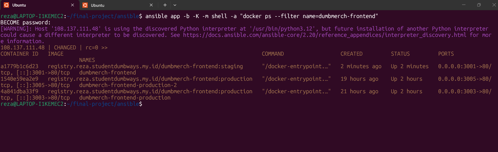
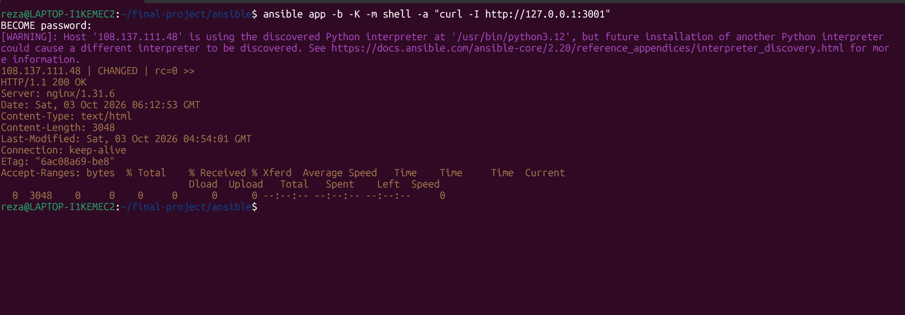
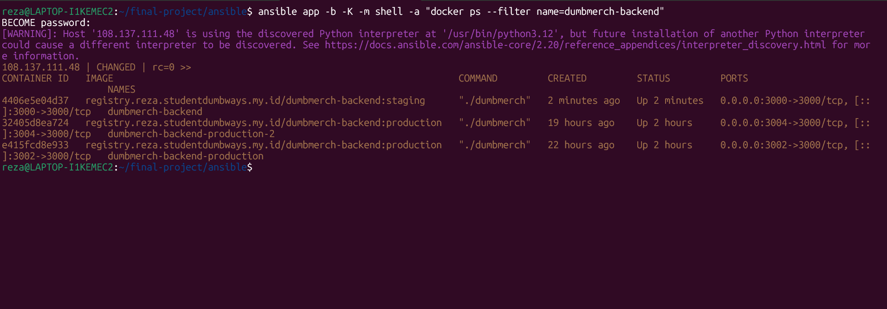
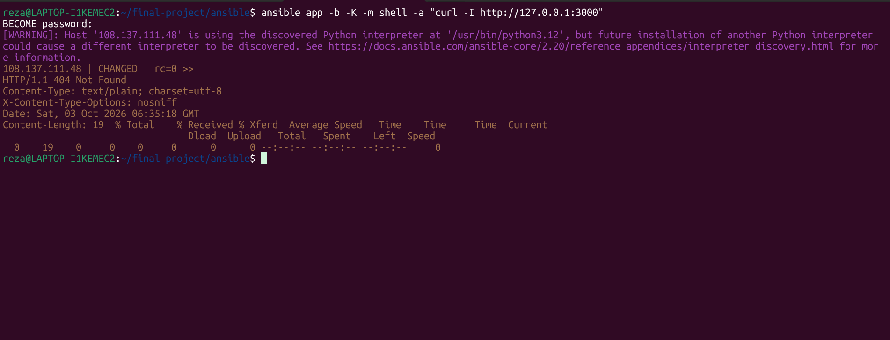
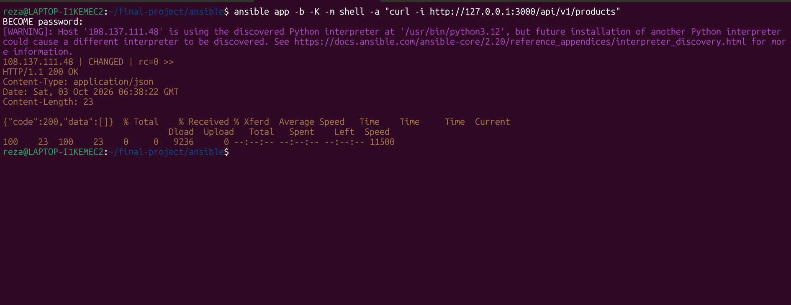
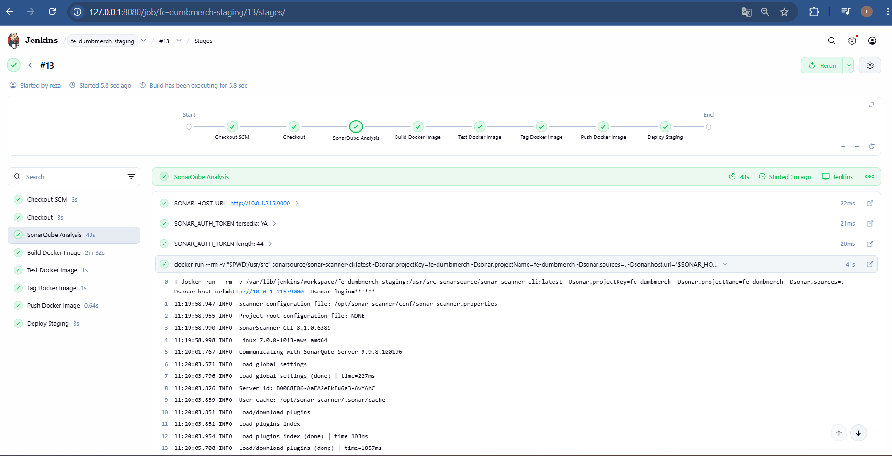
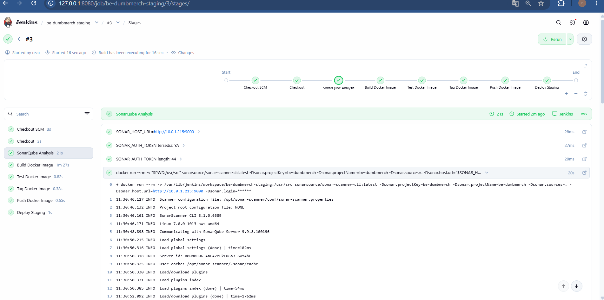

## Verifikasi Frontend Staging
Setelah Jenkins melakukan deployment Frontend Staging, container diperiksa pada App Server.
Command:
```
ansible app -b -K -m shell \
-a "docker ps --filter name=dumbmerch-frontend"
```
Hasil menunjukkan container Frontend staging berjalan:
```registry.reza.studentdumbways.my.id/dumbmerch-frontend:staging```

Container:
```
dumbmerch-frontend
```
Port:
```3001 -> 80``

Artinya:
```
App Server:3001
       │
       ▼
Frontend Container:80
```



## Testing Frontend Staging
Setelah memastikan container berjalan, dilakukan HTTP test terhadap Frontend.
Command:
```
ansible app -b -K -m shell \
-a "curl -I http://127.0.0.1:3001"
```

Response yang diperoleh:
```HTTP/1.1 200 OK```

Server:
```nginx/1.31.6```

Response 200 OK menunjukkan bahwa request HTTP berhasil diterima oleh NGINX yang berjalan di dalam container Frontend.


## Verifikasi Backend Staging
Selanjutnya dilakukan pemeriksaan terhadap container Backend Staging.
Command:
```
ansible app -b -K -m shell \
-a "docker ps --filter name=dumbmerch-backend"
```
Container yang berjalan:
```dumbmerch-backend```

Image:
```registry.reza.studentdumbways.my.id/dumbmerch-backend:staging```

Port:
3000 -> 3000

Sehingga alurnya:
```
App Server:3000
       │
       ▼
Backend Container:3000
```


## Testing Backend Staging
Setelah container Backend dipastikan berjalan, dilakukan HTTP request ke Backend.
Command:
```
ansible app -b -K -m shell \
-a "curl -I http://127.0.0.1:3000"
```
Response yang diperoleh:
```HTTP/1.1 404 Not Found```

Response 404 Not Found pada root / tidak berarti container mati.
Pada aplikasi Backend, endpoint / memang tidak digunakan sebagai endpoint API yang diuji.
Hal tersebut justru menunjukkan bahwa request sudah mencapai aplikasi Backend dan aplikasi memberikan HTTP response.




## Testing Backend API
Karena root Backend menghasilkan 404, testing dilanjutkan ke endpoint API yang memang digunakan aplikasi.
Endpoint:
```/api/v1/products```

Command:
```
ansible app -b -K -m shell \
-a "curl -i http://127.0.0.1:3000/api/v1/products"
```
Response:
```HTTP/1.1 200 OK```

Content-Type:
```application/json```

Response:
```{"code":200,"data":[]}```

Artinya request berhasil mencapai endpoint API Backend dan Backend memberikan response JSON dengan HTTP status 200.



## Kesimpulan Testing Backend
Dari dua pengujian Backend:
```
Root Backend
GET /
HTTP 404

API Backend
GET /api/v1/products
HTTP 200
```
Testing endpoint API menjadi validasi utama karena endpoint tersebut merupakan endpoint aplikasi yang digunakan.
Alurnya:
```
Client
   │
   │ GET /api/v1/products
   ▼
App Server
   │
   ▼
Backend Container
   │
   ▼
Backend Application
   │
   ▼
HTTP 200
JSON Response
```

## SonarQube
Selain testing aplikasi secara langsung, menggunakan SonarQube.
SonarQube digunakan untuk melakukan static code analysis terhadap source code aplikasi.
SonarQube pada environment ini berjalan pada App Server:
```10.0.1.215:9000```

Pipeline Jenkins staging melakukan SonarQube Analysis sebelum proses build Docker image berikutnya.
Alur pipeline staging:
```
Checkout SCM
      ↓
Checkout
      ↓
SonarQube Analysis
      ↓
Build Docker Image
      ↓
Test Docker Image
      ↓
Tag Docker Image
      ↓
Push Docker Image
      ↓
Deploy Staging
```
Dengan demikian SonarQube menjadi bagian dari pipeline CI/CD staging.

## SonarQube Analysis Frontend
Pipeline:
```fe-dumbmerch-staging```

menjalankan stage:
```SonarQube Analysis```

Pada Jenkins terlihat:
```
Checkout SCM          ✓
Checkout               ✓
SonarQube Analysis     ✓
Build Docker Image     ✓
Test Docker Image      ✓
Tag Docker Image       ✓
Push Docker Image      ✓
Deploy Staging         ✓
```



## Konfigurasi SonarQube Frontend
Dari log Jenkins, SonarQube menggunakan:
```SONAR_HOST_URL=http://10.0.1.215:9000```

Jenkins juga memiliki SonarQube authentication token.
Pada log pipeline terlihat:
```
SONAR_AUTH_TOKEN tersedia: YA
```
Kemudian Jenkins menjalankan SonarScanner menggunakan Docker image:
```sonarsource/sonar-scanner-cli:latest```

Command yang dijalankan berbentuk:
```
docker run --rm \
  -v "$PWD:/usr/src" \
  sonarsource/sonar-scanner-cli:latest \
  -Dsonar.projectKey=fe-dumbmerch \
  -Dsonar.projectName=fe-dumbmerch \
  -Dsonar.sources=. \
  -Dsonar.host.url="$SONAR_HOST_URL" \
  -Dsonar.login=******
```
Parameter:
```
sonar.projectKey
    = fe-dumbmerch

sonar.projectName
    = fe-dumbmerch

sonar.sources
    = .

sonar.host.url
    = http://10.0.1.215:9000
```
`-v "$PWD:/usr/src"` digunakan agar source code workspace Jenkins tersedia di dalam container SonarScanner.

## SonarQube Analysis Backend
Testing SonarQube juga diterapkan pada Backend staging.
Pipeline:
```be-dumbmerch-staging```

memiliki stage:
```
SonarQube Analysis
```
Urutannya:
```
Checkout SCM
      ↓
Checkout
      ↓
SonarQube Analysis
      ↓
Build Docker Image
      ↓
Test Docker Image
      ↓
Tag Docker Image
      ↓
Push Docker Image
      ↓
Deploy Staging
```




## Konfigurasi SonarQube Backend
Backend menggunakan SonarQube Server yang sama:
```http://10.0.1.215:9000```

Project:
```sonar.projectKey=be-dumbmerch```

Project name:
```sonar.projectName=be-dumbmerch```

Source:
```sonar.sources=.```

Scanner dijalankan menggunakan:
```sonarsource/sonar-scanner-cli:latest```

Pipeline juga menggunakan authentication token untuk melakukan komunikasi dengan SonarQube Server.

## Hasil SonarQube Backend
Pada Jenkins terlihat:
````
Checkout SCM          ✓
Checkout               ✓
SonarQube Analysis     ✓
Build Docker Image     ✓
Test Docker Image      ✓
Tag Docker Image       ✓
Push Docker Image      ✓
Deploy Staging         ✓
````
Durasi SonarQube Analysis:
```
21s
```
SonarScanner berhasil berkomunikasi dengan:
```SonarQube Server 9.9.8.100196```

Dengan demikian Backend staging berhasil menjalankan SonarQube Analysis sebagai bagian dari pipeline.
