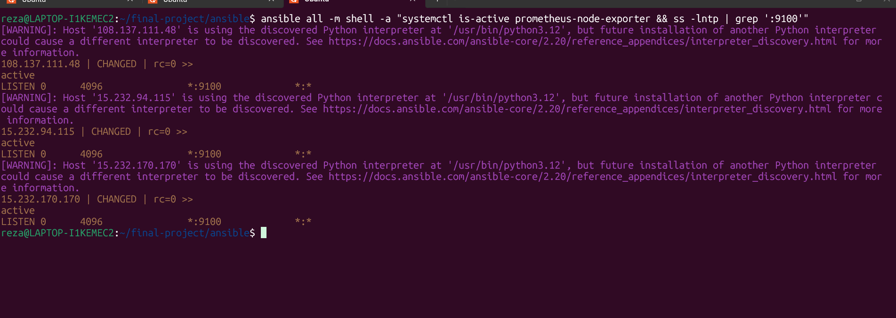
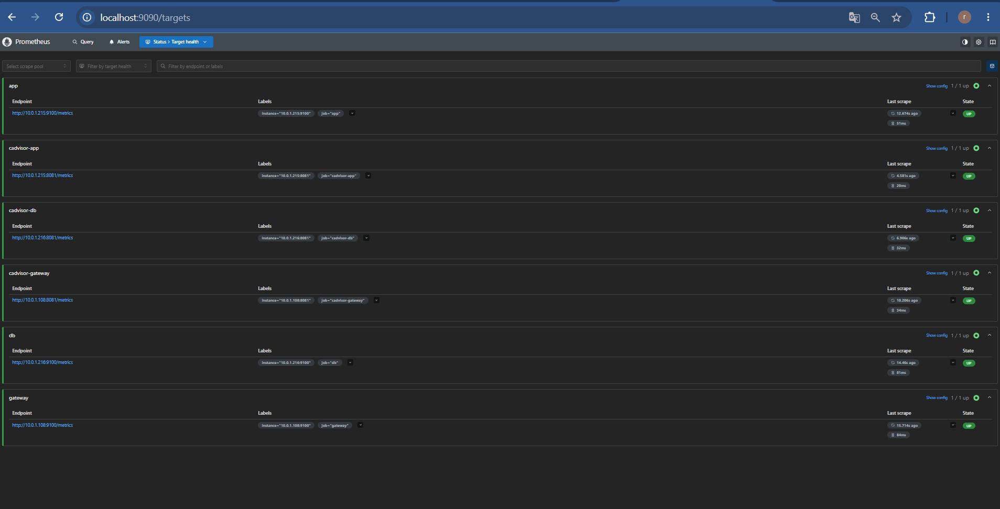
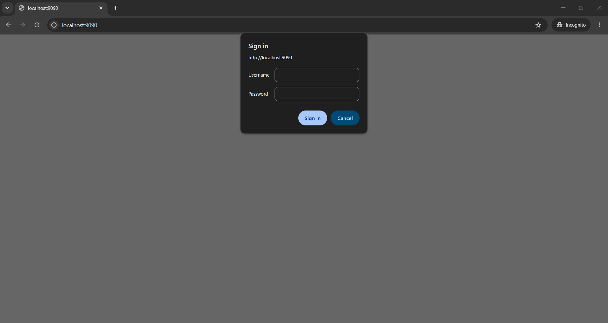
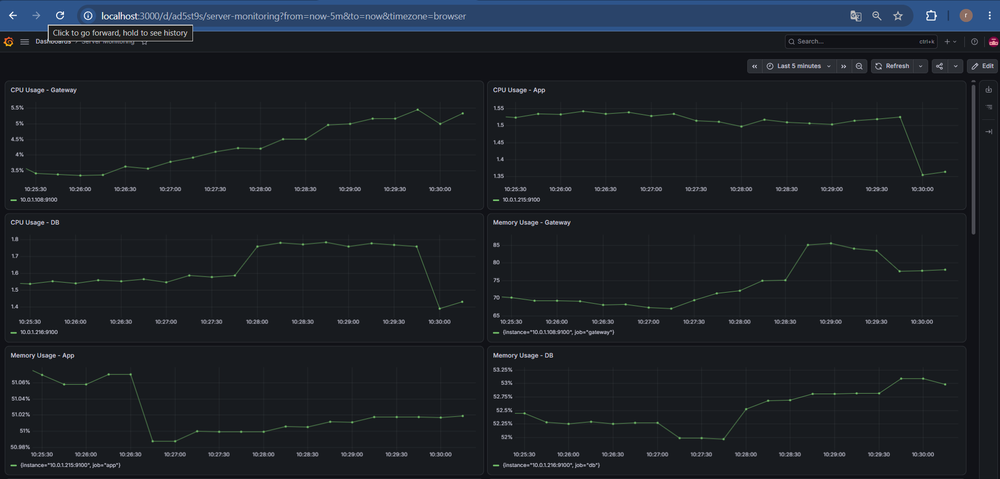
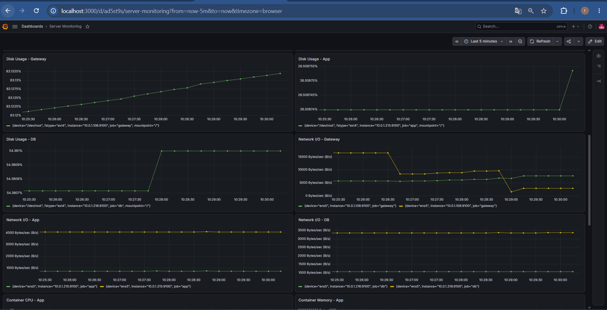
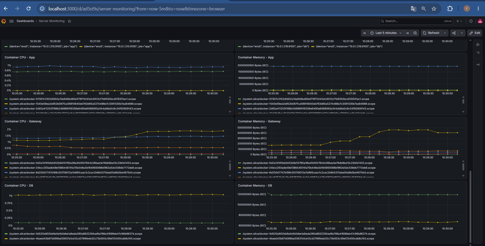
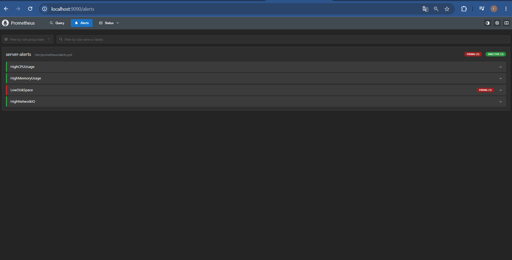
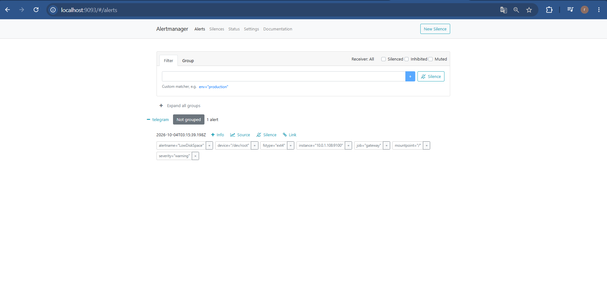
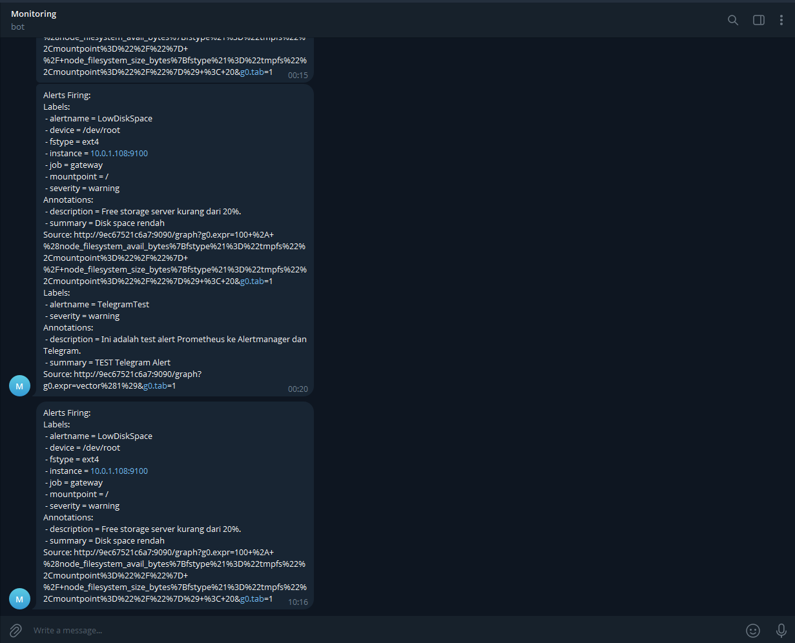

## Server yang Dimonitor
Environment menggunakan tiga server utama:
| Server | Private IP | Fungsi |
|---|---|---|
| Gateway | `10.0.1.108` | NGINX, Jenkins, Monitoring |
| App | `10.0.1.215` | Frontend, Backend, Docker |
| DB | `10.0.1.216` | PostgreSQL, Docker |

Monitoring mengambil metric dari server tersebut.
Endpoint Node Exporter:
```
Gateway
10.0.1.108:9100

App
10.0.1.215:9100

DB
10.0.1.216:9100
```
Endpoint cAdvisor:
```
Gateway
10.0.1.108:8081

App
10.0.1.215:8081

DB
10.0.1.216:8081
```

## Node Exporter
Node Exporter digunakan untuk mengambil metric dari operating system server.
Metric yang dikumpulkan antara lain digunakan untuk monitoring:
```
- CPU
- Memory
- Filesystem / Disk
- Network
```
Ansible playbook:
```playbooks/node-exporter.yaml```

Playbook menggunakan:
```hosts: all```

Kemudian menginstall package:
```prometheus-node-exporter```

dan menjalankan service:
```prometheus-node-exporter```

Service juga dibuat enable sehingga dijalankan saat server melakukan boot.
Source playbook menggunakan:
```
- name: Install Node Exporter on all servers
  hosts: all
  become: true
```
Kemudian:
```
- name: Install prometheus-node-exporter
  ansible.builtin.apt:
    name: prometheus-node-exporter
    state: present
    update_cache: true
```
Service dijalankan menggunakan:
```
- name: Enable and start Node Exporter
  ansible.builtin.systemd:
    name: prometheus-node-exporter
    enabled: true
    state: started
```
Dengan demikian Node Exporter menjadi sumber metric server untuk Prometheus.


## Verifikasi Node Exporter
Verifikasi dilakukan menggunakan Ansible:
```
ansible all -m shell \
-a "systemctl is-active prometheus-node-exporter && ss -lntp | grep ':9100'"
```
Hasil menunjukkan service:
```active```

dan port:
```*:9100```

Port 9100 merupakan endpoint Node Exporter.



Screenshot ini menunjukkan Node Exporter aktif pada server yang diuji.

## Prometheus
Prometheus digunakan sebagai sistem utama untuk:
```
1. Mengambil metric dari Node Exporter.
2. Mengambil metric dari cAdvisor.
3. Menyimpan metric.
4. Mengevaluasi alert rule.
5. Mengirim alert ke Alertmanager.
```
Prometheus dijalankan pada Gateway.
Port:
``
9090
``
Konfigurasi dibuat oleh Ansible pada:
```/opt/prometheus/config/prometheus.yml```

Prometheus menggunakan:
global:
``  scrape_interval: 15s``

Artinya Prometheus melakukan scrape metric secara berkala setiap 15 detik.

## Prometheus Targets
Prometheus memiliki beberapa target.
Node Exporter
```
Gateway:
10.0.1.108:9100

App:
10.0.1.215:9100

DB:
10.0.1.216:9100

cAdvisor
Gateway:
10.0.1.108:8081

App:
10.0.1.215:8081

DB:
10.0.1.216:8081
```
Konfigurasi Prometheus menggunakan job:
```
- job_name: "gateway"
  static_configs:
    - targets: ["10.0.1.108:9100"]

- job_name: "app"
  static_configs:
    - targets: ["10.0.1.215:9100"]

- job_name: "db"
  static_configs:
    - targets: ["10.0.1.216:9100"]
```
Untuk container:
```
- job_name: "cadvisor-gateway"
  static_configs:
    - targets: ["10.0.1.108:8081"]

- job_name: "cadvisor-app"
  static_configs:
    - targets: ["10.0.1.215:8081"]

- job_name: "cadvisor-db"
  static_configs:
    - targets: ["10.0.1.216:8081"]
```

## Verifikasi Prometheus Targets
Prometheus Targets dapat dilihat melalui:
```http://localhost:9090/targets```

Pada halaman Targets terlihat target:
```
app
cadvisor-app
cadvisor-db
cadvisor-gateway
db
gateway
```
Target berstatus:
```UP```

Status UP menunjukkan Prometheus berhasil melakukan scrape endpoint target tersebut.
Screenshot:


Screenshot ini menjadi bukti bahwa Prometheus berhasil terhubung ke Node Exporter dan cAdvisor.

## Prometheus Basic Authentication
Prometheus dilindungi menggunakan Basic Authentication.
Konfigurasi dibuat pada:
```/opt/prometheus/config/web.yml```

Konfigurasi menggunakan:
```
basic_auth_users:
  admin: "<password hash>"
```
Password disimpan dalam bentuk hash dan tidak ditulis sebagai password plaintext pada konfigurasi.
Prometheus kemudian dijalankan dengan:
```--web.config.file=/etc/prometheus/web.yml```

Source Ansible memang menjalankan Prometheus dengan:
command:
```
  - "--config.file=/etc/prometheus/prometheus.yml"
  - "--web.config.file=/etc/prometheus/web.yml"
```

## Verifikasi Basic Authentication
Ketika Prometheus dibuka tanpa authentication, browser menampilkan dialog:
```
Sign in

Username
Password
```
Hal tersebut menunjukkan Basic Authentication aktif.



Alur:
```
Browser
   │
   │ HTTP Request
   ▼
Prometheus :9090
   │
   │ Authentication
   ▼
Username + Password
   │
   ▼
Prometheus UI
```

## Grafana
Grafana digunakan sebagai dashboard visualisasi metric.
Grafana berjalan pada Gateway.
Port:
```3000```

Ansible membuat:
```
/opt/grafana
/opt/grafana/data
```
dan menjalankan container:
```grafana```

Image:
```grafana/grafana```

Port mapping:
```3000:3000```

Data Grafana disimpan pada:
```/opt/grafana/data```

Source `grafana.yaml` menjalankan Grafana dengan restart policy always dan volume persistent tersebut.

## Grafana Server Monitoring
Dashboard Grafana digunakan untuk menampilkan resource server:
```
- CPU Gateway
- CPU App
- CPU DB
- Memory Gateway
- Memory App
- Memory DB
```



## Grafana Disk dan Network Monitoring
Selain CPU dan memory, dashboard juga menampilkan:
```
Disk
Disk Usage - Gateway
Disk Usage - App
Disk Usage - DB

Network
Network I/O - Gateway
Network I/O - App
Network I/O - DB
```



Monitoring disk menggunakan metric filesystem dari Node Exporter.
Monitoring network menggunakan metric interface network.
Pada Gateway, konfigurasi alert Network I/O secara khusus menggunakan interface:
```ens5```

Source Prometheus menetapkan threshold Network I/O Gateway lebih dari:
```10 MB/s```

selama:
```
5 menit
```


## Container Monitoring
Selain server resource, monitoring juga dilakukan terhadap container.
cAdvisor digunakan sebagai sumber metric container.
Target cAdvisor:
```
Gateway
10.0.1.108:8081

App
10.0.1.215:8081

DB
10.0.1.216:8081
```
Grafana kemudian menampilkan:
```
Container CPU
Container Memory
```
untuk server yang memiliki container.



Dashboard menampilkan:
```
Container CPU - App
Container Memory - App

Container CPU - Gateway
Container Memory - Gateway

Container CPU - DB
Container Memory - DB
```
Alur monitoring container:
```
Docker Container
       │
       ▼
    cAdvisor
       │
       ▼
   Prometheus
       │
       ▼
     Grafana
```

## Alerting
Monitoring tidak hanya menampilkan metric.
Prometheus juga digunakan untuk mengevaluasi kondisi tertentu dan menghasilkan alert.
Alert rule disimpan pada:
```/opt/prometheus/config/alerts.yml```

File tersebut dimasukkan ke Prometheus menggunakan:
rule_files:
  ```- "/etc/prometheus/alerts.yml"```

Source Prometheus mendefinisikan empat alert utama:
```
HighCPUUsage
HighMemoryUsage
LowDiskSpace
HighNetworkIO
```

## Alert HighCPUUsage
Rule:
```HighCPUUsage```

Trigger ketika CPU usage:
```> 80%```

selama:
```5 menit```

Label:
```severity: warning```

Summary:
```CPU usage tinggi```

Description:
```CPU server di atas 80% selama 5 menit.```

Secara sederhana:
```
CPU > 80%
    │
    │ selama 5 menit
    ▼
HighCPUUsage
    │
    ▼
Alertmanager
```

## Alert HighMemoryUsage
Rule:
```HighMemoryUsage```

Trigger ketika penggunaan memory:
```> 80%```

selama:
```5 menit```

Label:
```severity: warning```

Summary:
```Memory usage tinggi```

Description:
```Memory server di atas 80% selama 5 menit.```

## Alert LowDiskSpace
Rule:
```LowDiskSpace```

Alert terjadi apabila free storage root filesystem:
```< 20%```

selama:
```5 menit```

Metric yang digunakan:
```node_filesystem_avail_bytes```

dibandingkan dengan:
```node_filesystem_size_bytes```

Mountpoint yang dipantau:
``/``

dan filesystem:
```tmpfs```

dikecualikan.
Summary:
```Disk space rendah```

Description:
```Free storage server kurang dari 20%.```

## Alert HighNetworkIO
Rule:
```HighNetworkIO```

Alert khusus digunakan untuk Gateway.
Interface:
```ens5```

Metric yang dihitung:
```
Network Receive
+
Network Transmit
```
Threshold:
```> 10 MB/s```

selama:
```5 menit```

Summary:
```Network I/O Gateway tinggi```

Description:
```Network I/O Gateway melebihi 10 MB/s selama 5 menit.```

Dengan demikian requirement monitoring Network I/O pada Gateway dapat dipantau melalui Prometheus.

## Verifikasi Alert Rules
Alert rules dapat dilihat pada halaman:
```Prometheus → Alerts```



Pada halaman tersebut terlihat:
```server-alerts```

dengan rule:
```
HighCPUUsage
HighMemoryUsage
LowDiskSpace
HighNetworkIO
```
Status alert ditampilkan oleh Prometheus berdasarkan kondisi metric saat itu.

## Alertmanager
Alertmanager digunakan sebagai komponen penerima alert dari Prometheus.
Alertmanager berjalan pada Gateway.
Port:
``9093``

Prometheus diarahkan ke Alertmanager melalui:
```172.17.0.1:9093```

Konfigurasi Prometheus:
```
alerting:
  alertmanagers:
    - static_configs:
        - targets:
            - "172.17.0.1:9093"
```
Source Prometheus menunjukkan target Alertmanager tersebut.

## Konfigurasi Alertmanager
Alertmanager dibuat menggunakan playbook:
```playbooks/alertmanager.yaml```

Alertmanager menggunakan:
```prom/alertmanager```

Port:
```9093:9093```

Configuration:
```/opt/alertmanager/config/alertmanager.yml```

Data:
```/opt/alertmanager/data```

Alertmanager menggunakan receiver:
```telegram```

Konfigurasi Telegram menggunakan:
```
telegram_configs:
  - bot_token: "{{ telegram_bot_token }}"
    chat_id: {{ telegram_chat_id }}
```
Credential Telegram diambil dari:
```inventory/group_vars/telegram_vault.yml```

## Verifikasi Alertmanager
Alertmanager dapat diakses melalui:
```http://localhost:9093```



Salah satu alert yang terlihat adalah:
```LowDiskSpace```

dengan label:
```
instance = 10.0.1.108:9100
job = gateway
mountpoint = /
severity = warning
```
Hal tersebut menunjukkan alert dari Prometheus dapat diterima oleh Alertmanager.

Telegram Notification
Alertmanager digunakan untuk meneruskan alert ke Telegram.
Alurnya:
```
Server
   │
   ▼
Node Exporter
   │
   ▼
Prometheus
   │
   │ Evaluasi Rule
   ▼
Alert
   │
   ▼
Alertmanager
   │
   │ Telegram Receiver
   ▼
Telegram
```




Contoh alert yang terlihat:
LowDiskSpace

dengan informasi:
```
instance = 10.0.1.108:9100
job = gateway
mountpoint = /
severity = warning
```
Telegram juga menampilkan informasi mengenai kondisi disk yang memicu alert.


