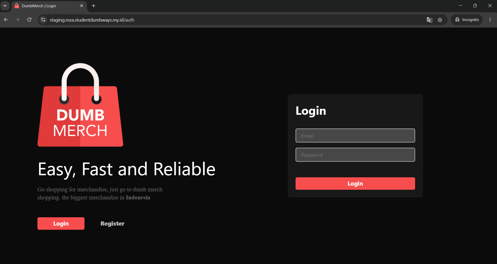
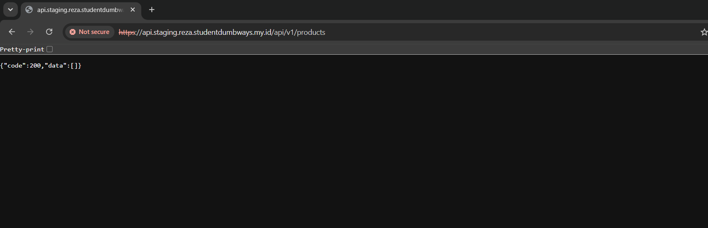
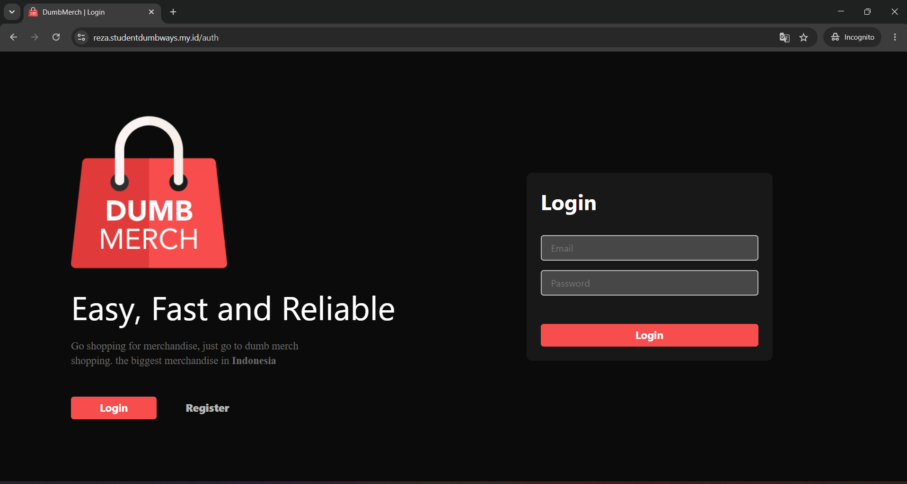
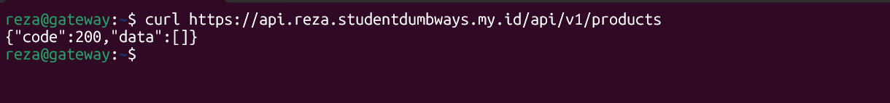
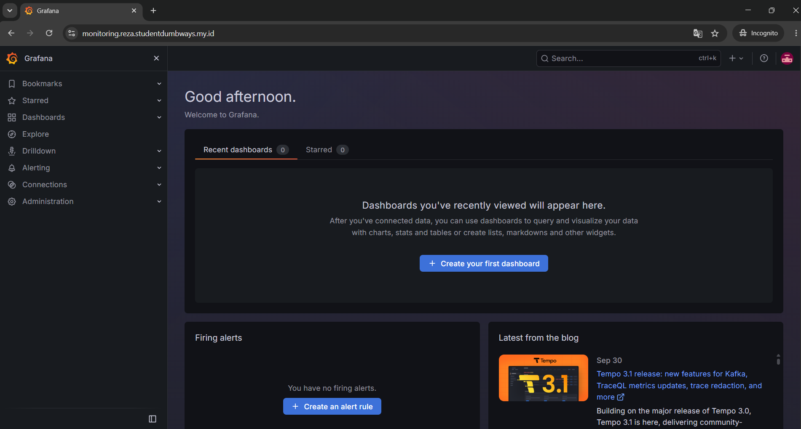

## Server yang Digunakan

Web Server dijalankan pada:

| Server | Private IP | Public IP | Service |
|---|---|---|---|
| Gateway | `10.0.1.108` | `15.232.170.170` | NGINX, Jenkins, Monitoring, Registry |

NGINX dikonfigurasi pada server Gateway menggunakan Ansible.

Playbook yang digunakan:

```text
ansible/playbooks/webserver.yaml
```

## File Ansible yang Digunakan
File utama:
```
ansible/
├── playbooks/
│   └── webserver.yaml
└── inventory/
    └── group_vars/
        └── cloudflare_vault.yml
```
webserver.yaml digunakan untuk melakukan konfigurasi NGINX, Certbot, Cloudflare credentials, SSL certificate, reverse proxy, serta automatic renewal.
Cloudflare API token disimpan menggunakan Ansible Vault melalui:
```inventory/group_vars/cloudflare_vault.yml```

Token tidak ditulis secara langsung di dalam konfigurasi NGINX.

## Install NGINX dan Certbot
Pada playbook webserver.yaml, package yang digunakan adalah:
```
- name: Install NGINX Certbot and Cloudflare plugin
  ansible.builtin.apt:
    name:
      - nginx
      - certbot
      - python3-certbot-dns-cloudflare
    state: present
    update_cache: true
```
Package yang di-install:
```
- nginx
- certbot
- python3-certbot-dns-cloudflare
```
NGINX digunakan sebagai Web Server sekaligus Reverse Proxy.
Certbot digunakan untuk membuat dan mengelola SSL certificate.
Plugin:
```python3-certbot-dns-cloudflare```

digunakan agar proses validasi domain dapat dilakukan melalui Cloudflare DNS.
Konfigurasi ini dibuat pada Gateway menggunakan Ansible.

## Cloudflare Credentials

Ansible membuat directory:

```text
/etc/letsencrypt
```
dengan permission:
```0700```

Kemudian membuat file:
```/etc/letsencrypt/cloudflare.ini```

dengan permission:
```0600```

Isi credentials menggunakan variable:
```dns_cloudflare_api_token = {{ cloudflare_api_token }}```

Dengan demikian API token Cloudflare tidak ditulis langsung di dalam playbook.
Konfigurasi credentials ini digunakan oleh Certbot ketika melakukan DNS challenge.

## NGINX Configuration
Ansible membuat konfigurasi:
```/etc/nginx/sites-available/finaltask.conf```

Kemudian konfigurasi tersebut diaktifkan menggunakan symbolic link:
```/etc/nginx/sites-enabled/finaltask.conf```

Konfigurasi NGINX memiliki beberapa upstream.
```
Staging Backend
upstream backend_staging {
    server 10.0.1.215:3000;
}
```
Backend staging berjalan pada App Server:
```
10.0.1.215:3000

Staging Frontend
upstream frontend_staging {
    server 10.0.1.215:3001;
}
```
Frontend staging berjalan pada:
```
10.0.1.215:3001

Production Backend
Production backend menggunakan dua endpoint:
upstream backend_production {
    server 10.0.1.215:3002;
    server 10.0.1.215:3004;
}
```
Port:
```
3002
3004
```
digunakan oleh dua container backend production yang sebelumnya dibuat pada.
Production Frontend
Production frontend menggunakan:
```
upstream frontend_production {
    server 10.0.1.215:3003;
    server 10.0.1.215:3005;
}
```
Port:
```
3003
3005
```
digunakan oleh dua container frontend production.
Konfigurasi upstream tersebut sesuai dengan container production.

## Domain yang Digunakan
menggunakan domain:
```
exporter.reza.studentdumbways.my.id
prom.reza.studentdumbways.my.id
monitoring.reza.studentdumbways.my.id
registry.reza.studentdumbways.my.id
staging.reza.studentdumbways.my.id
api.staging.reza.studentdumbways.my.id
reza.studentdumbways.my.id
api.reza.studentdumbways.my.id
```
Semua domain tersebut diarahkan ke Gateway.
Gateway kemudian menentukan service tujuan berdasarkan server_name pada konfigurasi NGINX.

## Redirect HTTP ke HTTPS
Untuk seluruh domain tersebut, NGINX menyediakan server block pada port:
```80```

Kemudian request diarahkan ke HTTPS menggunakan:
```
location / {
    return 301 https://$host$request_uri;
}
```
Artinya apabila client mengakses:
```http://reza.studentdumbways.my.id```

maka NGINX akan mengarahkan request menjadi:
```https://reza.studentdumbways.my.id```

Hal yang sama diterapkan pada domain service lainnya.
Dengan konfigurasi ini, akses HTTP tidak digunakan sebagai akses utama aplikasi.


## Wildcard SSL Certificate
Untuk HTTPS digunakan wildcard certificate.
Certbot dijalankan menggunakan:
```
certbot certonly \
  --dns-cloudflare \
  --dns-cloudflare-credentials /etc/letsencrypt/cloudflare.ini \
  --dns-cloudflare-propagation-seconds 30 \
  --non-interactive \
  --agree-tos \
  --email reza@studentdumbways.my.id \
  -d reza.studentdumbways.my.id \
  -d '*.reza.studentdumbways.my.id'
```
Certificate yang dibuat mencakup:
```
reza.studentdumbways.my.id
*.reza.studentdumbways.my.id
```
Wildcard:
```*.reza.studentdumbways.my.id```

memungkinkan certificate digunakan untuk subdomain seperti:
```
staging.reza.studentdumbways.my.id
api.staging.reza.studentdumbways.my.id
prom.reza.studentdumbways.my.id
monitoring.reza.studentdumbways.my.id
registry.reza.studentdumbways.my.id
api.reza.studentdumbways.my.id
```
Certificate disimpan pada:
```/etc/letsencrypt/live/reza.studentdumbways.my.id/```

File certificate yang digunakan NGINX:
```
fullchain.pem
privkey.pem
```

## HTTPS Frontend Staging
Domain:
```staging.reza.studentdumbways.my.id```

digunakan untuk mengakses frontend staging.
NGINX menggunakan:
```proxy_pass http://frontend_staging;```

yang mengarah ke:
```10.0.1.215:3001```

Pada pengujian browser, frontend staging berhasil diakses melalui:
```https://staging.reza.studentdumbways.my.id```

Hasilnya menampilkan halaman login DumbMerch.




## HTTPS Backend Staging
Backend staging menggunakan domain:
```
api.staging.reza.studentdumbways.my.id
```
NGINX menggunakan upstream:
```
upstream backend_staging {
    server 10.0.1.215:3000;
}
```
Request kemudian diteruskan menggunakan:
```
location / {
    proxy_pass http://backend_staging;

    proxy_set_header Host $host;
    proxy_set_header X-Real-IP $remote_addr;
    proxy_set_header X-Forwarded-For $proxy_add_x_forwarded_for;
    proxy_set_header X-Forwarded-Proto $scheme;
}
```
Backend staging berjalan pada:
```10.0.1.215:3000```

Pengujian Backend Staging
Endpoint yang diuji:
```
https://api.staging.reza.studentdumbways.my.id/api/v1/products
```

Response yang diperoleh:
```
{"code":200,"data":[]}
```

Response tersebut menunjukkan endpoint API memberikan response dengan code: 200.




## HTTPS Frontend Production
Frontend production menggunakan domain:
```reza.studentdumbways.my.id```

NGINX menggunakan upstream:
```
upstream frontend_production {
    server 10.0.1.215:3003;
    server 10.0.1.215:3005;
}
```
Endpoint yang digunakan:
```
10.0.1.215:3003
10.0.1.215:3005
```
Port `3003` digunakan oleh frontend production utama.
Port `3005` digunakan oleh replica frontend production.
Replica frontend production dibuat melalui playbook:
```ansible/playbooks/loadbalancer.yaml```

Container replica menggunakan nama:
```dumbmerch-frontend-production-2```

dan port:
```3005```

Request production frontend diteruskan menggunakan:
```
location / {
    proxy_pass http://frontend_production;

    proxy_set_header Host $host;
    proxy_set_header X-Real-IP $remote_addr;
    proxy_set_header X-Forwarded-For $proxy_add_x_forwarded_for;
    proxy_set_header X-Forwarded-Proto $scheme;
}
```

Pengujian Frontend Production
Frontend production diuji melalui:
```https://reza.studentdumbways.my.id/auth```

Hasil pengujian menampilkan halaman login DumbMerch.




## HTTPS Backend Production
Backend production menggunakan domain:
```api.reza.studentdumbways.my.id```

NGINX menggunakan upstream:
```
upstream backend_production {
    server 10.0.1.215:3002;
    server 10.0.1.215:3004;
}
```
Endpoint yang digunakan:
```
10.0.1.215:3002
10.0.1.215:3004
```

Port `3002` digunakan oleh backend production utama.
Port `3004` digunakan oleh replica backend production.
Replica backend production dibuat melalui:
```
ansible/playbooks/loadbalancer.yaml
```

Container replica menggunakan nama:
```dumbmerch-backend-production-2```

dan port:
```3004```

Request production backend diteruskan menggunakan:
```
location / {
    proxy_pass http://backend_production;

    proxy_set_header Host $host;
    proxy_set_header X-Real-IP $remote_addr;
    proxy_set_header X-Forwarded-For $proxy_add_x_forwarded_for;
    proxy_set_header X-Forwarded-Proto $scheme;
}
```
Pengujian Production Backend
Pengujian dilakukan menggunakan:
```curl https://api.reza.studentdumbways.my.id/api/v1/products```

Response:
```{"code":200,"data":[]}```

Response code: 200 menunjukkan endpoint production backend memberikan response yang berhasil.



## Monitoring
Grafana

Grafana dijalankan pada Gateway dan diakses melalui domain:
```monitoring.reza.studentdumbways.my.id```

Pada konfigurasi NGINX Task 9, domain tersebut diarahkan ke Grafana yang berjalan pada:
```127.0.0.1:3000```

Konfigurasi reverse proxy:
```
server {
    listen 443 ssl;
    listen [::]:443 ssl;

    server_name monitoring.reza.studentdumbways.my.id;

    ssl_certificate /etc/letsencrypt/live/reza.studentdumbways.my.id/fullchain.pem;
    ssl_certificate_key /etc/letsencrypt/live/reza.studentdumbways.my.id/privkey.pem;

    location / {
        proxy_pass http://127.0.0.1:3000;

        proxy_set_header Host $host;
        proxy_set_header X-Real-IP $remote_addr;
        proxy_set_header X-Forwarded-For $proxy_add_x_forwarded_for;
        proxy_set_header X-Forwarded-Proto $scheme;
    }
}
```
Pengujian Grafana
Grafana diuji melalui browser menggunakan:
```monitoring.reza.studentdumbways.my.id```

Hasil pengujian berhasil menampilkan halaman utama Grafana.



## Node Exporter
Node Exporter diakses melalui domain:
```exporter.reza.studentdumbways.my.id```

NGINX meneruskan request ke:
```127.0.0.1:9100```

Konfigurasi reverse proxy:
```
server {
    listen 443 ssl;
    listen [::]:443 ssl;

    server_name exporter.reza.studentdumbways.my.id;

    ssl_certificate /etc/letsencrypt/live/reza.studentdumbways.my.id/fullchain.pem;
    ssl_certificate_key /etc/letsencrypt/live/reza.studentdumbways.my.id/privkey.pem;

    location / {
        proxy_pass http://127.0.0.1:9100;

        proxy_set_header Host $host;
        proxy_set_header X-Real-IP $remote_addr;
        proxy_set_header X-Forwarded-For $proxy_add_x_forwarded_for;
        proxy_set_header X-Forwarded-Proto $scheme;
    }
}
```
Konfigurasi tersebut digunakan agar Node Exporter dapat diakses melalui domain Gateway.

## Private Docker Registry
Private Docker Registry menggunakan domain:
```registry.reza.studentdumbways.my.id```

Registry dijalankan pada Gateway menggunakan container:
```private-registry```

Container menggunakan image:
```registry:2```

dan port:
```5000:5000```

Registry menggunakan volume:
```registry_data:/var/lib/registry```

Konfigurasi Compose Registry berada pada:
```ansible/files/registry/compose.yaml```

Pada konfigurasi NGINX Task 9, request dari:
```registry.reza.studentdumbways.my.id```

diteruskan ke:
```127.0.0.1:5000```

Konfigurasi reverse proxy:
```
server {
    listen 443 ssl;
    listen [::]:443 ssl;

    server_name registry.reza.studentdumbways.my.id;

    ssl_certificate /etc/letsencrypt/live/reza.studentdumbways.my.id/fullchain.pem;
    ssl_certificate_key /etc/letsencrypt/live/reza.studentdumbways.my.id/privkey.pem;

    client_max_body_size 0;

    location / {
        proxy_pass http://127.0.0.1:5000;

        proxy_set_header Host $host;
        proxy_set_header X-Real-IP $remote_addr;
        proxy_set_header X-Forwarded-For $proxy_add_x_forwarded_for;
        proxy_set_header X-Forwarded-Proto $scheme;
    }
}
```

## Prometheus
Prometheus dijalankan pada Gateway.
Prometheus dikonfigurasi untuk melakukan scraping metrics dari Gateway, App Server, dan Database Server.
```
Target Node Exporter:

10.0.1.108:9100
10.0.1.215:9100
10.0.1.216:9100
```
```
Target cAdvisor:
10.0.1.108:8081
10.0.1.215:8081
10.0.1.216:8081
```
Prometheus menggunakan interval scraping:
```15s```

Prometheus juga dikonfigurasi untuk menggunakan Alertmanager sebagai sistem pengiriman alert.
Konfigurasi Prometheus dibuat menggunakan Ansible melalui:
```ansible/playbooks/prometheus.yaml```

Prometheus kemudian dapat diakses melalui reverse proxy NGINX menggunakan:
```prom.reza.studentdumbways.my.id```

## Alertmanager
Alertmanager dijalankan pada Gateway.
Container Alertmanager menggunakan image:
```prom/alertmanager```

dan port:
```9093:9093```

Konfigurasi Alertmanager digunakan untuk mengirimkan alert melalui Telegram.
Credential Telegram disimpan menggunakan Ansible Vault:
```ansible/inventory/group_vars/telegram_vault.yml```

Konfigurasi Alertmanager dibuat melalui:
```ansible/playbooks/alertmanager.yaml```

## SSL Automatic Renewal
Untuk melakukan renewal certificate secara otomatis, Ansible membuat script:
```/usr/local/bin/renew-finaltask-ssl.sh```

Isi script:
```
#!/bin/bash
certbot renew --quiet
systemctl reload nginx
```
Script tersebut kemudian dijalankan menggunakan cron.
Konfigurasi cron:
```
Minute: 0
Hour: 3
```
Sehingga proses renewal dijadwalkan setiap hari pada pukul:
```03:00```

Konfigurasi cron dibuat menggunakan Ansible:
```
- name: Configure SSL renewal cron
  ansible.builtin.cron:
    name: "Renew Final Task SSL"
    minute: "0"
    hour: "3"
    job: "/usr/local/bin/renew-finaltask-ssl.sh"
```

## Validasi Konfigurasi NGINX
Setelah konfigurasi Task 9 dibuat, Ansible melakukan validasi konfigurasi NGINX menggunakan:
```nginx -t```

Validasi dilakukan untuk memastikan syntax konfigurasi NGINX dapat diterima sebelum service di-reload.
Setelah validasi selesai, Ansible melakukan reload NGINX:
```
- name: Reload NGINX
  ansible.builtin.systemd:
    name: nginx
    state: reloaded
```
Konfigurasi juga diaktifkan menggunakan symbolic link:
```/etc/nginx/sites-enabled/finaltask.conf```

yang mengarah ke:
```/etc/nginx/sites-available/finaltask.conf```

Konfigurasi NGINX lama untuk Registry dan Load Balancer juga dihapus dari:
```/etc/nginx/sites-enabled/```

sebelum konfigurasi digunakan.
