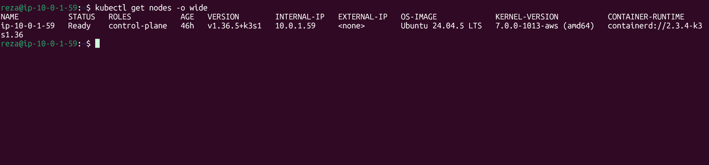
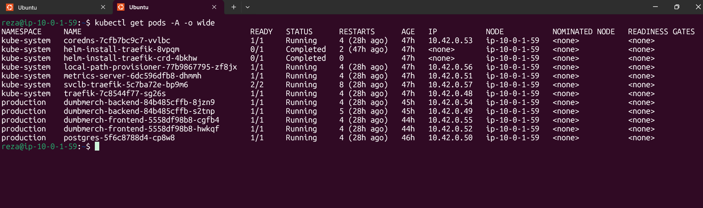
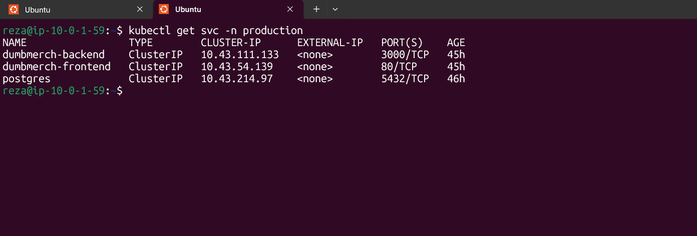
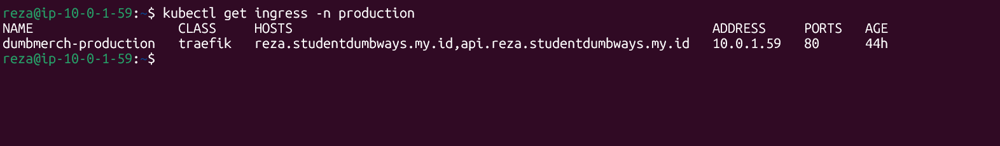
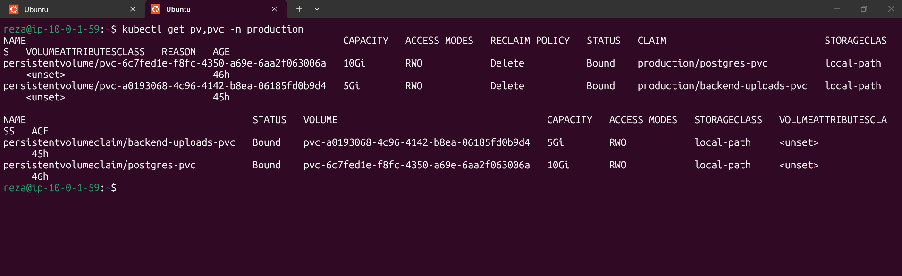
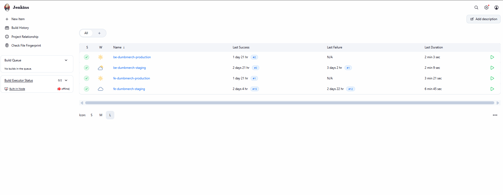

## Overview
Aplikasi production DumbMerch dijalankan menggunakan K3s Single Node.
K3s digunakan sebagai Kubernetes distribution pada satu server. Node tersebut berfungsi sebagai control-plane sekaligus tempat menjalankan workload production.
Application production dijalankan pada namespace:
production

Komponen production yang dijalankan di dalam Kubernetes terdiri dari:
```
Frontend
Backend
PostgreSQL
```
Frontend dan backend masing-masing memiliki dua replica, sedangkan PostgreSQL menggunakan satu replica.
Kubernetes dijalankan menggunakan single node, sehingga seluruh workload production berada pada node yang sama.

## Kubernetes / K3s Single Node
Kubernetes menggunakan K3s.
Node yang digunakan:
```
Node Name  : ip-10-0-1-59
Private IP : 10.0.1.59
Role       : control-plane
Status     : Ready
OS         : Ubuntu 24.04.5 LTS
K3s Version: v1.36.5+k3s1
```
K3s berjalan menggunakan container runtime:
```containerd```

Pengecekan node dilakukan menggunakan:
```kubectl get nodes -o wide```

Hasil pengujian menunjukkan:
```
NAME           STATUS   ROLES          VERSION
ip-10-0-1-59   Ready    control-plane  v1.36.5+k3s1
```
Status Ready menunjukkan bahwa node dapat digunakan untuk menjalankan workload Kubernetes.
Node tersebut memiliki private IP:
```10.0.1.59```




## Production Namespace
Application production dijalankan pada namespace:
```production```

Namespace ini digunakan untuk memisahkan workload application production dari komponen sistem Kubernetes/K3s.
Pod production yang berjalan terdiri dari:
```
dumbmerch-backend
dumbmerch-frontend
postgres
```
Seluruh workload production berada pada node:
```ip-10-0-1-59```

## Production Pods
Pengecekan pod dilakukan menggunakan:
```kubectl get pods -A -o wide```

Pada namespace production, terdapat:
```
dumbmerch-backend-84b485cffb-8jzn9
dumbmerch-backend-84b485cffb-s2tnp

dumbmerch-frontend-5558df98b8-cgfb4
dumbmerch-frontend-5558df98b8-hwkqf

postgres-5f6c87884-cp8w8
```
Status seluruh pod production pada saat pengujian adalah:
Running

Dengan readiness:
```1/1```

Struktur workload production:
| Application | Replica | Status |
|---|---:|---|
| DumbMerch Backend | 2 | Running |
| DumbMerch Frontend | 2 | Running |
| PostgreSQL | 1 | Running |

Dengan demikian terdapat total:
```5 production pods```

yang berjalan pada single node K3s.
### Backend
Backend production memiliki dua pod:
```
dumbmerch-backend-84b485cffb-8jzn9
dumbmerch-backend-84b485cffb-s2tnp
```
Keduanya memiliki status:
```1/1 Running```

Penggunaan dua replica memungkinkan backend memiliki lebih dari satu pod yang tersedia di dalam deployment.

### Frontend
Frontend production juga memiliki dua pod:
```
dumbmerch-frontend-5558df98b8-cgfb4
dumbmerch-frontend-5558df98b8-hwkqf
```
Keduanya memiliki status:
```1/1 Running```

### PostgreSQL
Database production dijalankan menggunakan satu pod:
```
postgres-5f6c87884-cp8w8
```
Pod PostgreSQL memiliki status:
```1/1 Running```




## Kubernetes Deployments
Selain pengecekan pod, deployment production diverifikasi menggunakan:
```kubectl get deployments -n production``

Hasil:
```
NAME                 READY   UP-TO-DATE   AVAILABLE
dumbmerch-backend    2/2     2            2
dumbmerch-frontend   2/2     2            2
postgres             1/1     1            1
```
Deployment yang tersedia:
```
dumbmerch-backend
dumbmerch-frontend
postgres
```
Backend memiliki:
```
2/2 READY
2 UP-TO-DATE
2 AVAILABLE
```
Frontend memiliki:
```
2/2 READY
2 UP-TO-DATE
2 AVAILABLE
```
PostgreSQL memiliki:
```
1/1 READY
1 UP-TO-DATE
1 AVAILABLE
```
Hasil tersebut menunjukkan bahwa replica yang diinginkan pada deployment tersedia dan berjalan.

## Kubernetes Services
Komunikasi antar komponen application menggunakan Kubernetes Service.
Service production diperiksa menggunakan:
```kubectl get svc -n production```

Hasil:
```
NAME                TYPE       CLUSTER-IP      PORT(S)

dumbmerch-backend   ClusterIP  10.43.111.133   3000/TCP
dumbmerch-frontend  ClusterIP  10.43.54.139    80/TCP
postgres            ClusterIP  10.43.214.97    5432/TCP
```
Terdapat tiga service utama.

### Backend Service
Nama service:
```dumbmerch-backend```

Type:
```ClusterIP```

Cluster IP:
```10.43.111.133```

Port:
```3000/TCP```

Service ini digunakan untuk menyediakan akses internal menuju backend production.

### Frontend Service
Nama service:
```dumbmerch-frontend```

Type:
```ClusterIP```

Cluster IP:
```10.43.54.139```

Port:
```80/TCP```

Service ini digunakan untuk menghubungkan traffic menuju frontend production.

### PostgreSQL Service
Nama service:
```postgres```

Type:
```ClusterIP```

Cluster IP:
```10.43.214.97```

Port:
```5432/TCP```

Service ini menyediakan akses internal menuju PostgreSQL.



Screenshot menunjukkan tiga service utama production:
```
dumbmerch-backend
dumbmerch-frontend
postgres
```
Seluruh service menggunakan tipe ClusterIP.

## Ingress
Untuk menyediakan akses dari domain menuju application production, digunakan Traefik Ingress yang tersedia pada K3s.
Ingress diperiksa menggunakan:
```kubectl get ingress -n production```

Hasil:
```
NAME                  CLASS    HOSTS
dumbmerch-production  traefik  reza.studentdumbways.my.id,
                               api.reza.studentdumbways.my.id
```
Address yang digunakan:
```
10.0.1.59
```
Port:
```80```

Ingress yang digunakan:
```dumbmerch-production```

dengan class:
```traefik```

Host yang dikonfigurasi:
```
reza.studentdumbways.my.id
api.reza.studentdumbways.my.id
```
Dengan konfigurasi tersebut, domain production diarahkan menuju routing yang disediakan oleh Ingress.
Alur akses production melalui Kubernetes:

```
Client
  │
  ▼
reza.studentdumbways.my.id
  │
  ▼
Traefik Ingress
  │
  ▼
dumbmerch-frontend Service
  │
  ▼
Frontend Pods
```
Sedangkan endpoint API menggunakan:
```api.reza.studentdumbways.my.id```

yang diarahkan melalui Ingress menuju service backend.




## Persistent Volume
Untuk menyimpan data secara persistent, production menggunakan Persistent Volume dan Persistent Volume Claim.
Pengecekan dilakukan menggunakan:
```kubectl get pv,pvc -n production```

Terdapat dua storage utama:
```
postgres-pvc
backend-uploads-pvc
```
Keduanya memiliki status:
```Bound```

dan menggunakan StorageClass:
```local-path```

### PostgreSQL Persistent Volume
PostgreSQL menggunakan PVC:
```production/postgres-pvc```

Kapasitas:
```10Gi```

Access mode:
```RWO```

Status:
```Bound```

StorageClass:
```local-path```

PVC tersebut terhubung dengan Persistent Volume:
```persistentvolume/pvc-6c7fed1e-f8fc-4350-a69e-6aa2f063006a```

Kapasitas:
```10Gi```

Dengan demikian storage PostgreSQL menggunakan persistent storage sebesar:
```10 GiB```

### Backend Upload Persistent Volume
Backend menggunakan PVC:
```production/backend-uploads-pvc```

Kapasitas:
```5Gi```

Access mode:
```RWO```

Status:
```Bound```

StorageClass:
```local-path```

PVC tersebut terhubung dengan Persistent Volume:
```persistentvolume/pvc-a0193068-4c96-4142-b8ea-06185fd0b9d4```

Kapasitas:
```5Gi```

Storage tersebut digunakan untuk kebutuhan upload pada backend.

Ringkasan Storage:
| PVC | Capacity | Status | StorageClass |
|---|---:|---|---|
| `postgres-pvc` | 10Gi | Bound | `local-path` |
| `backend-uploads-pvc` | 5Gi | Bound | `local-path` |




## Production Application
Application production yang digunakan pada Kubernetes terdiri dari:
```
Frontend
Backend
PostgreSQL
```

Frontend dan backend masing-masing menggunakan dua replica.
Konfigurasi workload yang terverifikasi:
```
Frontend
└── 2 Pods

Backend
└── 2 Pods

PostgreSQL
└── 1 Pod
```
Seluruh komponen tersebut dijalankan pada satu node K3s:
```ip-10-0-1-59```

Dengan private IP:
```10.0.1.59```

Service internal yang digunakan:
```
Frontend
└── dumbmerch-frontend:80

Backend
└── dumbmerch-backend:3000

PostgreSQL
└── postgres:5432
```
Routing dari external traffic menggunakan:
```Traefik Ingress```

dengan host:
```
reza.studentdumbways.my.id
api.reza.studentdumbways.my.id
```

## CI/CD menggunakan Jenkins
CI/CD pada project menggunakan Jenkins.
Pada Jenkins terdapat pipeline terpisah untuk frontend dan backend, baik untuk environment staging maupun production.
Job yang tersedia:
```
be-dumbmerch-production
be-dumbmerch-staging
fe-dumbmerch-production
fe-dumbmerch-staging
```

Dengan demikian pipeline yang tersedia terdiri dari:
| Application | Environment | Jenkins Job |
|---|---|---|
| Backend | Production | `be-dumbmerch-production` |
| Backend | Staging | `be-dumbmerch-staging` |
| Frontend | Production | `fe-dumbmerch-production` |
| Frontend | Staging | `fe-dumbmerch-staging` |

Pada halaman Jenkins, job-job tersebut memiliki riwayat Last Success.
Hal tersebut menunjukkan bahwa pipeline frontend dan backend untuk staging dan production telah tersedia dan memiliki successful build.


