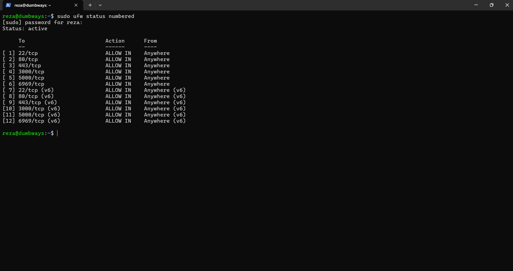

# Task Linux Server

## 1. Akses Server Menggunakan Terminal

Pada task ini saya mengakses Ubuntu Server menggunakan PowerShell melalui SSH.

IP server yang digunakan: 192.168.100.208

command yang digunakan:
ssh reza@192.168.100.208

setelah berhasil login, muncul:
reza@dumbways:~$

ini menunjukan saya berhasil terhubung ke Ubuntu Server melalui SSH.

## 2. Konfigurasi SSH Public Key
pada bagian ini saya melakukan konfigurasi SSH agar server dapat menggunakan authentication dengan public key.

1. saya membuat SSH key di windows menggunakan:
   ssh-keygen

2. public key ditampilakan menggunkan:
   type $env:USERPROFILE\.ssh\id_ed25519.pub

3. Setelah itu saya login ke Ubuntu Server:
   ssh reza@192.168.100.208

4. Kemudian membuat folder SSH:
   mkdir -p ~/.ssh

5. Public key dimasukkan ke dalam file:
   nano ~/.ssh/authorized_keys

6. Setelah public key dimasukkan, saya mengatur permission:
   chmod 700 ~/.ssh
   chmod 600 ~/.ssh/authorized_keys

7. Kemudian konfigurasi SSH diperiksa melalui:
   sudo nano /etc/ssh/sshd_config

8. Pada konfigurasi tersebut digunakan:
   PubkeyAuthentication yes

9. Setelah melakukan perubahan konfigurasi, saya mengecek apakah konfigurasi SSH memiliki error:
   sudo sshd -t

10. Jika tidak terdapat error, SSH kemudian di-restart:
   sudo systemctl restart ssh

Setelah itu saya mencoba melakukan SSH kembali dari PowerShell untuk memastikan konfigurasi dapat digunakan

## 3. Text Manipulation

Pada bagian ini saya mencoba beberapa command dasar untuk text manipulation menggunakan `echo`, `cat`, `grep`, dan `sed`.

### 1. Echo

Saya menggunakan echo untuk membuat file dan memasukkan teks ke dalam file.

  echo "Reza" > coba.txt
  

### 2. cat
Saya menggunakan cat untuk melihat isi file.
   cat data.txt
 
Hasil:

   reza

Kemudian saya menambahkan beberapa teks:

  echo "arishadilah" >> data.txt

Untuk melihat semua isi file:

  cat data.txt

### 3. Grep
Saya menggunakan grep untuk mencari kata tertentu di dalam file.
   grep "reza" coba.txt

Hasil:
   reza
   
### 4. Sed
Saya menggunakan sed untuk mengganti teks.

sed 's/arishadilah/dumbways/' coba.txt

Hasil:
 reza
 dumbways

## 4. Konfigurasi UFW

Pada bagian ini saya mengaktifkan UFW sebagai firewall pada Ubuntu Server dan memberikan akses pada port yang diminta.

Port yang dibuka:

- 22
- 80
- 443
- 3000
- 5000
- 6969

Pertama saya memberikan akses untuk port-port tersebut:
   sudo ufw allow 22/tcp
   sudo ufw allow 80/tcp
   sudo ufw allow 443/tcp
   sudo ufw allow 3000/tcp
   sudo ufw allow 5000/tcp
   sudo ufw allow 6969/tcp

kemudian saya mengaktifkan UFW:
   sudo ufw ebable

untuk melihat status dan port yg sudah diberi akses, saya menggunakan:
   sudo ufw status numbered

hasil menunjukan UFW sudah aktif dan seluruh port yg saya allow sudah mendapatkan akses.

